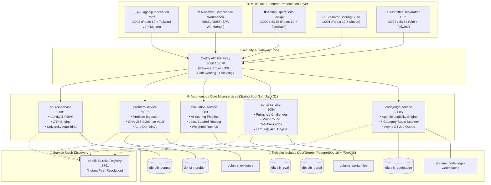
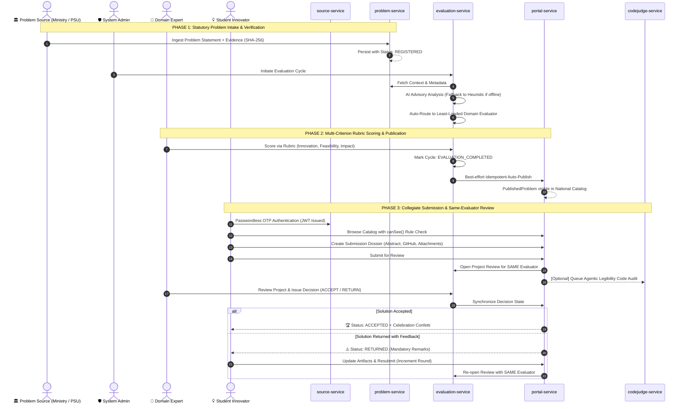

<div align="center">

# 🇮🇳 SIH26043 · National Innovation Lifecycle Platform
### *Enterprise Microservices Architecture for Problem-to-Solution Orchestration*

**Smart India Hackathon 2024 · Ministry of Education & AICTE · Government of India**

[](https://openjdk.org/)
[](https://spring.io/projects/spring-boot)
[](https://spring.io/projects/spring-cloud)
[](https://react.dev/)
[](https://www.typescriptlang.org/)
[](https://tailwindcss.com/)
[](https://www.postgresql.org/)
[](https://www.docker.com/)
[](https://caddyserver.com/)
[](#)

<p align="center">
  <b>A fault-tolerant, multi-tenant digital backbone connecting Ministries, PSUs, Universities, Evaluators, and Innovators into an unbroken cycle of national problem solving.</b>
</p>

<p align="center">
  <a href="#-system-architecture">Architecture</a> •
  <a href="#-the-core-breakthrough">Core Innovations</a> •
  <a href="#-end-to-end-workflow">Lifecycle Workflow</a> •
  <a href="#-microservices-deep-dive">Microservices</a> •
  <a href="#-micro-frontend-suite">Frontends</a> •
  <a href="#-quick-start--orchestration">Quick Start</a> •
  <a href="#-security--governance">Security</a>
</p>

---

</div>

## 🌟 Executive Pitch & Problem Context

In traditional national innovation hackathons, thousands of problem statements submitted by ministries, state departments, and industry leaders suffer from **three critical systemic fractures**:

1. **Context Loss Between Problem Formulation & Evaluation**: Evaluators assessing student solutions are rarely the same experts who vetted the original problem. Subtle statutory requirements, nuances, and technical constraints get diluted or lost.
2. **Brittle Evaluation Pipelines**: Systems relying purely on external AI models crash or stall during rate limits, service outages, or API changes.
3. **Fragmented Stakeholder Experience**: Different user personas (Ministry Admins, Statutory Reviewers, Technical Evaluators, University Innovators) are forced into generic, one-size-fits-all interfaces.

### 🎯 The SIH26043 Solution
**SIH26043** solves this with an enterprise microservices grid powered by **The Continuity of Expertise Paradigm**:
- The **exact domain expert** who evaluates and scores the original statutory problem statement remains permanently assigned to assess the subsequent student solution submissions.
- **Dual-Track AI Augmentation**: Fast LLM qualitative analysis with deterministic heuristic fallback ensures **zero pipeline downtime**—the system never halts, even if external AI models are unreachable.
- **Agentic Legibility Code Evaluation (CodeJudge)**: A novel automated auditing engine that grades student repositories across 7 dimensions to benchmark AI-readiness, architecture hygiene, and security posture.

---

## 🏛️ System Architecture

The platform operates as a decentralized, polyglot microservices mesh. **No shared monolith. No shared database.** Every microservice owns its private PostgreSQL database with Flyway version-controlled migrations, registers with Netflix Eureka, and is fronted by a reverse-proxy API Gateway.



---

## ⚡ The Core Breakthrough: 7 Pillars of Innovation

```
┌──────────────────────────────────────────────────────────────────────────────────┐
│                             7 PILLARS OF SIH26043                                │
├──────────────────────────┬──────────────────────────┬────────────────────────────┤
│ 1. Continuity of         │ 2. Dual-Track Resilient  │ 3. Zero-Friction HEI       │
│    Domain Expertise      │    AI Augmentation       │    Auto-Binding            │
│    Same evaluator scores │    Advisory LLM +        │    Source accounts become  │
│    problem & solution.   │    deterministic fallback│    portal participants.    │
├──────────────────────────┼──────────────────────────┼────────────────────────────┤
│ 4. Absolute Database     │ 5. Agentic Legibility    │ 6. Cryptographic Evidence  │
│    Decoupling            │    CodeJudge Engine      │    Vault                   │
│    Zero shared schemas;  │    7-dimension repo      │    SHA-256 hash checks &   │
│    pure internal APIs.   │    AI readiness grader.  │    isolated storage tiers. │
├──────────────────────────┴──────────────────────────┴────────────────────────────┤
│ 7. Dynamic canSee() Multi-Tenant Access Control                                  │
│    Bulletproof mathematical isolation for OPEN / UNIVERSITY / RESTRICTED pools.  │
└──────────────────────────────────────────────────────────────────────────────────┘
```

### 1. 🔄 Continuity of Domain Expertise
When a student team submits a proposed solution to a published challenge, the platform **automatically looks up the exact evaluator who originally scored and categorized that problem statement**. The project review is routed directly to that evaluator's workbench. Context is never lost; evaluation is fast, deeply technical, and consistent.

### 2. 🤖 Dual-Track Resilient AI Augmentation
AI is built to accelerate humans, never to create bottlenecks. The evaluation and problem services utilize an OpenAI-compatible interface with local model routing (`DeepSeek-V4` / `GPT-4o`):
- **Primary Track**: Generates structured categorization (sector, complexity, impact vectors, tech relevance).
- **Fallback Track**: If the LLM times out or is unreachable, the system instantly switches to a **deterministic heuristic engine** without throwing exceptions. The review pipeline continues uninterrupted.

### 3. 🎓 Zero-Friction University Auto-Binding
Higher Education Institutions (HEIs) often face redundant registration hurdles. In SIH26043:
- When a verified HEI logs into the Innovation Portal via OTP, the system queries the `source-service` internal API.
- If an active and verified HEI source account exists, it **instantly auto-promotes the user to a `UNIVERSITY` participant** with official institution binding. No secondary approval delays.

### 4. 🧩 Agentic Legibility Engine (CodeJudge)
Innovations in 2024+ will be co-developed and maintained by autonomous AI agents. The `codejudge-service` introduces a novel metric: **Agentic Legibility** (0–100 score) evaluated across 7 categories:
1. **Bootstrap** — Zero-friction setup scripts and dependencies.
2. **Commands** — Deterministic test/build/lint runner definitions.
3. **Docs** — API contracts, architectural manifests, and design guides.
4. **Architecture** — Clean separation of concerns and modularity.
5. **Testing** — Unit/integration coverage and regression harnesses.
6. **Quality** — Typing discipline, linting rules, and code cleanliness.
7. **Security** — Hardcoded secrets inspection, sanitization, and dependency vulnerabilities.

---

## 🔄 End-to-End Workflow



---

## ⚙️ Microservices Deep Dive

All backend services are built on **Java 21 LTS** and **Spring Boot 3.x / 4.x**, utilizing optimistic locking (`@Version`) across all mutable aggregates to eliminate race conditions.

| Service Name | Port | Database | Primary Responsibility | Key Technical Highlight |
|:---|:---:|:---|:---|:---|
| **`source-service`** | `:8081` | `sih_source` | Identity, RBAC, Phone/Email OTP, HEI verification | Cryptographic identity pepper, 15-min JWT access / 7-day rotating refresh tokens, rate-limited OTP |
| **`problem-service`** | `:8082` | `sih_problem` | Problem registration, evidence vault, domain tagging | PostGIS coordinates, SHA-256 evidence integrity checks, automated university domain resolver |
| **`evaluation-service`** | `:8083` | `sih_eval` | AI analysis, evaluator routing, rubric scoring | Least-loaded assignment algorithm, deterministic heuristic fallback, same-evaluator project review binding |
| **`portal-service`** | `:8084` | `sih_portal` | National catalog, participant dossiers, submissions | Dynamic `canSee()` multi-tenant filtering, optimistic file streaming, multi-round resubmission lifecycle |
| **`codejudge-service`** | `:8085` | `sih_codejudge` | Static repository analysis, agentic legibility scoring | Python 3 + Git execution sandbox, 7-category scoring matrix, async worker queue with state recovery |
| **`eureka-server`** | `:8761` | *In-Memory* | Service registration and peer discovery | Self-preservation disabled for rapid container failure detection |
| **`gateway` (Caddy)** | `:8080` | *N/A* | Reverse proxy, path routing, SSL termination | Shields `/internal/**` routes from external internet exposure |

---

## 🖥️ Micro-Frontend Suite

The presentation tier comprises **5 dedicated frontends** tailored to specific user workflows:

```
frontend/
├── innovation-portal-ui/   # 🇮🇳 Flagship National Challenge & Submissions Portal
├── reviewer-ui/            # ⚖️ Statutory Reviewer & Legal Compliance Workbench
├── admin-ui/               # 🛡️ Central Ministry Operations & User Cockpit
├── evaluator-ui/           # 🎯 Double-Blind Rubric Scoring & Consensus Sandbox
└── submitter-ui/           # 📝 Guided Problem Statement Ingestion Wizard
```

### Application Comparison

| Application | Dev Port | Docker Port | Technology Stack | Primary Persona | Unique UI/UX Features |
|:---|:---:|:---:|:---|:---|:---|
| **Innovation Portal UI** | `3003` | `3003` | React 19, Tailwind v4, Framer Motion, Confetti | All Stakeholders / Public | Tricolor atmospheric sweeps, split-screen OTP login, grid/table problem filter, dossier viewer, milestone confetti |
| **Reviewer UI** | `8085` / `8086` | — | Modern ES6+, Glassmorphism, Material Symbols | Statutory Reviewer | Dual-pane case review, source authenticity checklist, one-click Windows `run.bat` launcher |
| **Admin UI** | `5175` | `3000` | React 19, TypeScript, TanStack Query, Tailwind | Ministry Ops | User role director, domain mapping matrix, full-lifecycle evaluation cycle monitoring, audit logs |
| **Evaluator UI** | `3001` | `3001` | React 19, Tailwind v4, Lucide, Motion | Domain Experts | Double-blind rubric cards, criteria weighting adjustments, automated score aggregation indicators |
| **Submitter UI** | `5174` | `3002` | Vite, Modern HTML5, Tailwind CSS | Problem Sources | Multi-step statutory disclosure wizard, Ministry/PSU taxonomy selector, draft autosave |

---

## 🔒 Security & Governance

```
┌────────────────────────────────────────────────────────────────────────┐
│                        SECURITY AT EVERY LAYER                         │
├──────────────────────────┬─────────────────────────────────────────────┤
│ Stateless Auth           │ HMAC-SHA256 JWTs with 15-min TTL and        │
│                          │ single-use rotating refresh tokens.         │
├──────────────────────────┼─────────────────────────────────────────────┤
│ Method-Level RBAC        │ Spring Security `@PreAuthorize` enforcing   │
│                          │ SUBMITTER, EVALUATOR, REVIEWER, ADMIN roles.│
├──────────────────────────┼─────────────────────────────────────────────┤
│ Edge Endpoint Shielding  │ Caddy API Gateway blocks all `/internal/**` │
│                          │ paths from external ingress requests.       │
├──────────────────────────┼─────────────────────────────────────────────┤
│ Zero Secret Leakage      │ All keys passed via environment variables;   │
│                          │ strict `.gitignore` rules prevent commits.  │
├──────────────────────────┼─────────────────────────────────────────────┤
│ Tamper-Evident Auditing  │ Per-service `audit_log` tables record actor,│
│                          │ action, entity ID, and IP address.          │
└──────────────────────────┴─────────────────────────────────────────────┘
```

### Multi-Tenant Access Control (`canSee` Matrix)
To prevent unauthorized leakage of classified or university-exclusive problem statements, access is rigorously validated at the database query level:

| Participant Type | `OPEN_TO_ALL` Problems | `UNIVERSITY_ONLY` Problems | `SELECTED_UNIVERSITIES` Problems |
|:---|:---:|:---:|:---:|
| **Student / General Innovator** | ✅ Visible | ❌ 404 Not Found | ❌ 404 Not Found |
| **University Participant** | ✅ Visible | ✅ Visible | ✅ Only if University is Whitelisted |

---

## 🚀 Quick Start & Orchestration

### Prerequisites
- **Docker & Docker Compose** (v20.10+)
- **Java 21 LTS** & **Maven 3.9+** (for manual backend builds)
- **Node.js 20+** & **npm** (for local frontend development)

---

### Option 1: One-Click Launch (Windows)
Double-click [`start-all.bat`](./start-all.bat) or run from PowerShell:
```cmd
start-all.bat
```
*This automatically builds backend containers, mounts PostgreSQL volumes, initializes Eureka, and spins up the frontend containers.*

---

### Option 2: Docker Compose Orchestration

```bash
# 1. Clone the repository
git clone https://github.com/your-org/sih26043-innovation-platform.git
cd bana-to-lete-hai-pehle

# 2. Package all microservices
cd backend
./mvnw -DskipTests clean package
cd ..

# 3. Start Backend Cluster (Databases, Eureka, 5 Services, Gateway)
cd backend
docker compose up -d --build
cd ..

# 4. Start Frontend Cluster (Admin, Evaluator, Submitter, Innovation Portal)
docker compose up -d --build
```

### Verification Commands
```bash
# Verify all backend containers are healthy
docker compose -f backend/docker-compose.yml ps

# Verify all frontend containers
docker compose ps

# Stream unified gateway logs
docker logs -f sih26043-gateway
```

---

### Option 3: Local Development (Hot Reload)

<details>
<summary><b>Click to expand local development commands</b></summary>

#### Microservices (Run individually in IDE or Terminal):
```bash
cd backend/source-service && ../mvnw spring-boot:run
cd backend/problem-service && ../mvnw spring-boot:run
cd backend/evaluation-service && ../mvnw spring-boot:run
cd backend/portal-service && ../mvnw spring-boot:run
cd backend/codejudge-service && ../mvnw spring-boot:run
```

#### Frontends (Run with instant HMR):
```bash
# Innovation Portal UI
cd frontend/innovation-portal-ui && npm install && npm run dev
# ➜ http://localhost:3003

# Reviewer Case Management UI
cd frontend/reviewer-ui && python -m http.server 8085
# ➜ http://localhost:8085/#/login

# Admin UI
cd frontend/admin-ui && npm install && npm run dev -- --port 5175
# ➜ http://localhost:5175

# Evaluator UI
cd frontend/evaluator-ui && npm install && npm run dev
# ➜ http://localhost:3001

# Submitter UI
cd frontend/submitter-ui && npm install && npm run dev
# ➜ http://localhost:5174
```

</details>

---

## 🗺️ Unified Port & Endpoint Matrix

### External Ingress (via Gateway: `:8080` / `:8090`)
| Route Prefix | Target Service | Functionality |
|:---|:---|:---|
| `/auth/*` | `source-service:8081` | OTP request, verification, JWT refresh, session logout |
| `/problems/*` | `problem-service:8082` | Problem submission, evidence upload, catalog queries |
| `/evaluation/*` | `evaluation-service:8083` | Evaluation cycles, rubric scoring, AI profile queries |
| `/portal/*` | `portal-service:8084` | Participant onboarding, submission dossier management |
| `/codejudge/*` | `codejudge-service:8085` | Repository auditing, legibility score lookups |
| `/users/*` | `source-service:8081` | User profiles, account role assignments |

---

## 📂 Project Directory Map

```
bana-to-lete-hai-pehle/
├── 📄 README.md                       # 🌟 Master System Documentation (You are here)
├── 📄 PROJECT_PITCH_REPORT.md         # 📑 Comprehensive Grand Finale Defense Report
├── 📄 ADMIN_UI_API_GUIDE.md           # 🛡️ API Blueprint & Integration Guide for Admin Portal
├── 📄 start-all.bat                   # ⚡ One-click Windows Orchestration Script
├── 📄 docker-compose.yml              # 🐳 Production Multi-Stage Frontend Orchestrator
├── 📁 backend/                        # ⚙️ Microservices Reactor Monorepo
│   ├── 📄 docker-compose.yml          # 🐳 Backend Grid Compose (Postgres, Eureka, Gateway, 5 Svcs)
│   ├── 📁 gateway/                    # 🚪 Caddyfile Reverse Proxy Configuration
│   ├── 📁 eureka-server/              # 🔭 Netflix Eureka Discovery Engine
│   ├── 📁 source-service/             # 👤 Identity, Auth, OTP & University Accounts
│   ├── 📁 problem-service/            # 📝 Problem Ingestion & SHA-256 Evidence Vault
│   ├── 📁 evaluation-service/         # 🎯 AI-Augmented Evaluation & Domain Routing
│   ├── 📁 portal-service/             # 🇮🇳 Public Catalog, Submissions & Review Tracking
│   ├── 📁 codejudge-service/          # 🤖 Agentic Legibility Engine & Static Analyzer
│   └── 📁 db/init/                    # 🗄️ Automated Database Initialization SQL Scripts
└── 📁 frontend/                       # 🌐 Micro-Frontend Applications
    ├── 📄 README.md                   # 🎨 Frontend Suite Architecture & Guide
    ├── 📁 innovation-portal-ui/       # 🇮🇳 Flagship Innovation Portal (Port :3003)
    ├── 📁 reviewer-ui/                # ⚖️ Statutory Reviewer Workbench (Port :8085 / :8086)
    ├── 📁 admin-ui/                   # 🛡️ Ministry Admin Control Center (Port :5175 / :3000)
    ├── 📁 evaluator-ui/               # 🎯 Evaluator Scoring Interface (Port :3001)
    └── 📁 submitter-ui/               # 📝 Submitter Intake Wizard (Port :5174 / :3002)
```

---

<div align="center">

### Built for the Future of Indian Innovation 🇮🇳
**Smart India Hackathon 2024 · Grand Finale Edition · Problem Statement SIH26043**

*Crafted with high engineering standards by the SIH26043 Innovation Team.*

</div>
