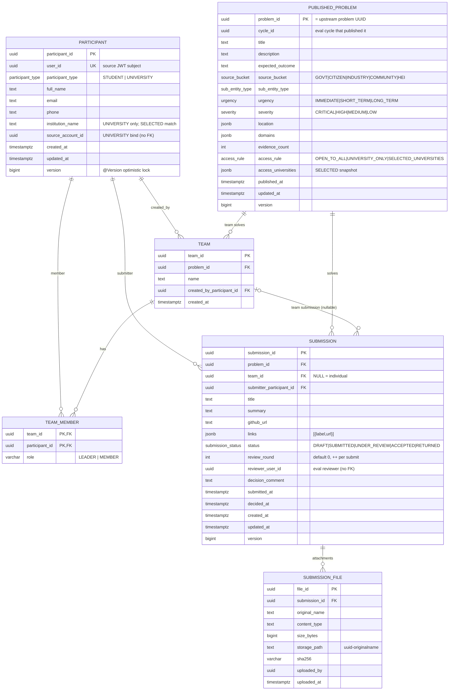
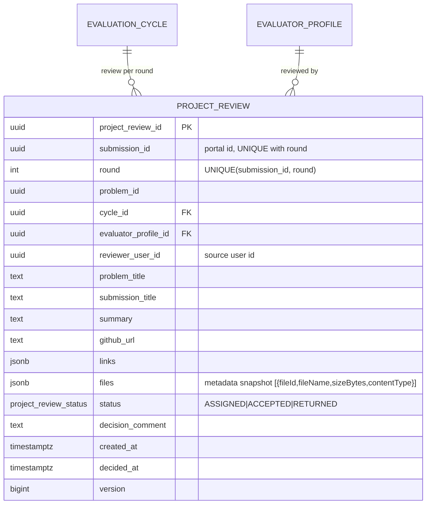
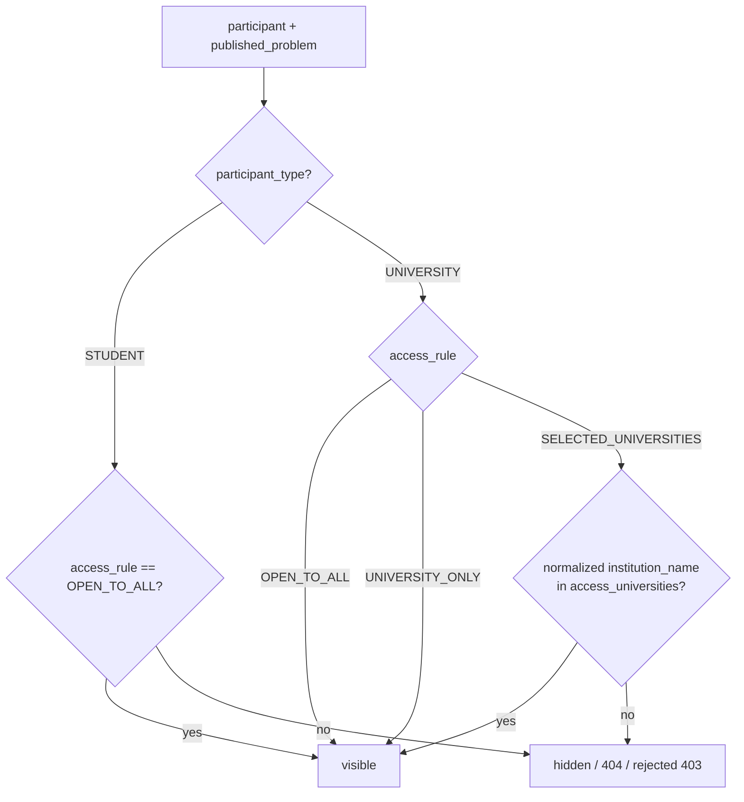
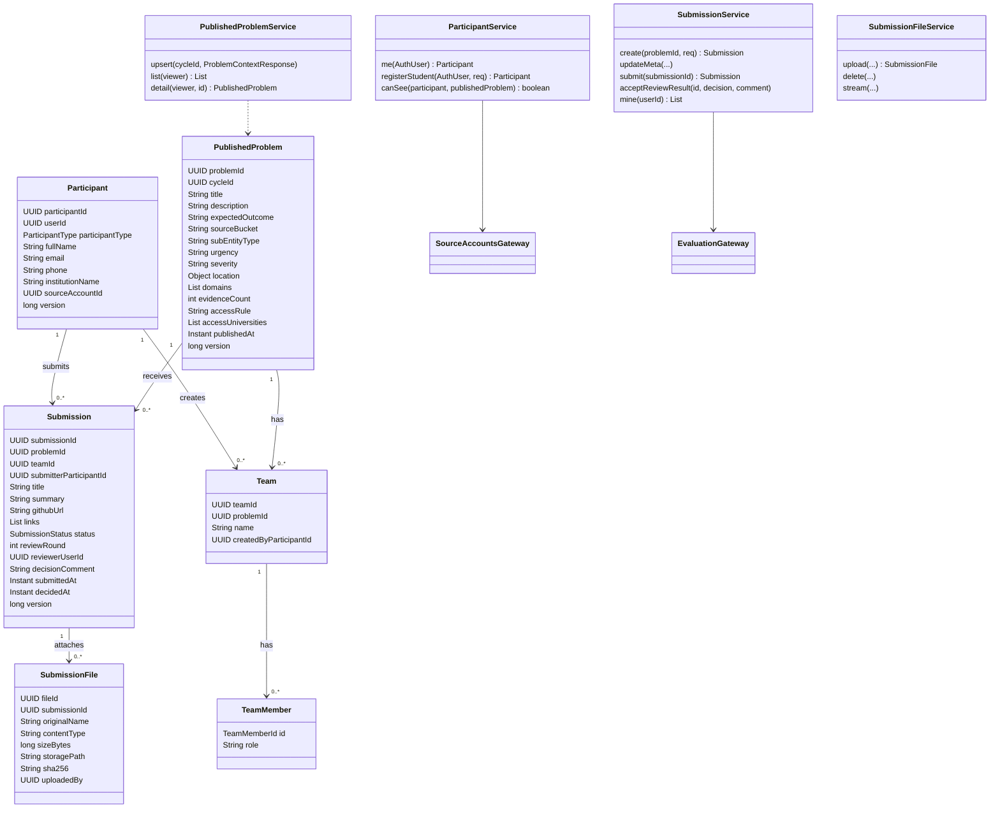
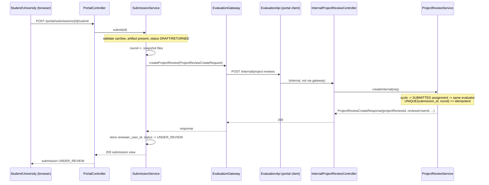
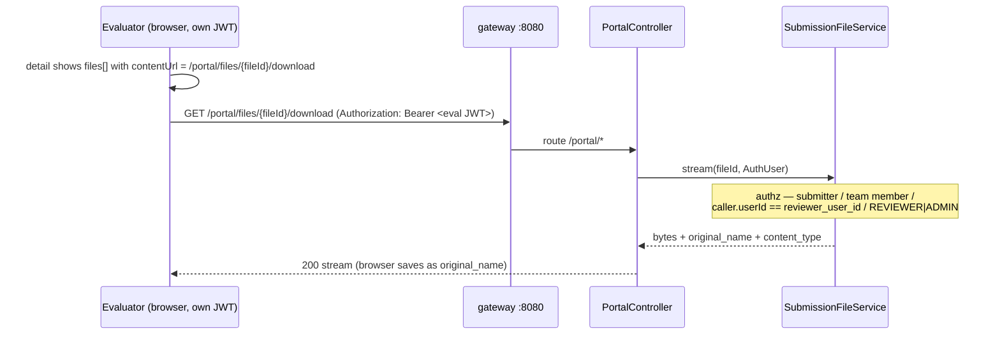

# SIH26043 — Portal Service: design & reference notes

> The **Innovation Portal** — the public surface where a fully-evaluated problem statement
> is *published* for students / universities to solve, and where project submissions are
> handed back to the **same evaluator** for a pass/return decision.
>
> This file is the reference for everything portal-service does: architecture & integration,
> data model (ER), flowcharts, UML (class + sequence), the full HTTP surface, internal
> service contracts, security, and deployment wiring. It mirrors the style of
> `evaluation-service.md` / `codejudgeservice.md` and stays true to the committed code.

---

## 1. What this service is

In the earlier pipeline a problem's life ended when its evaluator submitted the last
scorecard: the cycle hit `EVALUATION_COMPLETED` and **nothing consumed the outcome**. The
portal closes that gap —

1. **Auto-publishes** the problem statement the moment evaluation completes
   (gate: `EVALUATION_COMPLETED`, fired from the evaluator's scorecard submit);
2. **Shows it to the right audience** — each problem carries an access rule
   (`OPEN_TO_ALL` / `UNIVERSITY_ONLY` / `SELECTED_UNIVERSITIES`), and every read is filtered
   per-participant, so a student never sees a restricted statement;
3. **Accepts project solutions** — solo students or teams (participants) create a
   submission on a problem they can see, attach artifacts (title/summary/github link/files),
   and submit;
4. **Routes the review to the same evaluator** who scored that problem's evaluation cycle
   (continuity), and receives the ACCEPT / RETURN decision back;
5. **Hosts the submission files** itself (bytes on a `portal-files` volume) and hands out
   JWT-authorized download URLs to the assigned reviewer.

It is a **separate service** (not a feature bolted onto problem-service) because this repo is
a microservices strangler with **no shared DB and no shared role model** — the portal keeps
its own catalog + participants + submissions + files and only ever talks to neighbours over
internal JSON HTTP.

```
              browser / JWT (source auth token)
                           │
              ┌────────────▼─────────────┐
              │   gateway :8080 (Caddy) │   path /portal /portal/* → portal-service:8084
              └────────────┬─────────────┘
                           │   (auth stays on source-service — no portal auth)
              ┌────────────▼─────────────┐
              │      portal-service      │  :8084  ·  DB sih_portal  ·  files volume
              │  participants, catalog,  │
              │  teams, submissions,     │
              │  submission files        │
              └───▲──────────▲───────────┘
        (2)HEI   │          │ (3)project review   ┌─────────────────────┐
     account list│          │  create push        │  evaluation-service │ :8083
              ┌──┴─────────┐│                 ┌───▼──┐   sih_eval        │
              │ source-svc │◄─────────────────┤      │  project_review  │
              │ :8081      │  (1)problem-snapshot │      │  (eval→portal) │
              │ /internal/ │  + (4)review-result  │      │                │
              └────────────┘  push                └──────┘                │
                                                     ▲  ▲                │
                                              problem :8082  eureka :8761│
                                              snapshot      discovery    │
                                              └───────────────────────────┘
```

### The four service-to-service arrows

| # | Direction | Contract | When |
|---|---|---|---|
| 1 | **eval → portal** | `POST /internal/published-problems` `{cycleId, problem: ProblemContextResponse}` | Auto after the last scorecard of a cycle (`EVALUATION_COMPLETED`), plus manual ADMIN/REVIEWER retry |
| 2 | **portal → source** | `GET /internal/users/{userId}/source-accounts` → `List<SourceAccountDetail>` | First contact: classify caller as STUDENT or UNIVERSITY participant (HEI account detection) |
| 3 | **portal → eval** | `POST /internal/project-reviews` `ProjectReviewCreateRequest` → `ProjectReviewCreateResponse` | On submission/resubmission: open a review work item for the same evaluator |
| 4 | **eval → portal** | `POST /internal/submissions/{submissionId}/review-result` `{decision, comment}` | Evaluator ACCEPT / RETURN lands back on the portal submission |

No DB is shared; every arrow is a JSON DTO in `edith-common` / service-local `client` packages,
resolved through **Eureka discovery** (service ids, load-balanced `@HttpExchange`), and never
routed through the public gateway (`/internal/**` stays on internal ports).

---

## 2. Why a separate service

- **Own identity model.** Participants are NOT a new JWT role — a participant is a *profile*
  bound to a source-service user id (`participant.user_id == JWT subject`). Universities that
  already exist in source-service log in with the same credentials; there is **no second
  registration** for them (auto-bind on first `GET /portal/me`).
- **Own catalog.** The portal snapshots problem statements at publish time so read-time never
  needs problem-service; `published_problem` is a self-sufficient row.
- **Own files.** Submission binaries live on a dedicated `portal-files` volume; evaluation-service
  only ever receives a *metadata* snapshot (`{fileId, fileName, sizeBytes, contentType}`).
- **Own lifecycle.** `DRAFT → SUBMITTED → UNDER_REVIEW → ACCEPTED | RETURNED` with review rounds,
  teams, and file authorization — none of which belongs to the source/problem/eval aggregates.

> **Locked decisions** (owner-approved, see the original plan `splendid-leaping-owl.md`):
> 1. Identity = reuse source auth (OTP + shared JWT); portal keeps only the participant profile.
> 2. Publish gate = automatic on `EVALUATION_COMPLETED` (best-effort, manual retry endpoint too).
> 3. Visibility = institution accounts only; `UNIVERSITY_ONLY` / `SELECTED_UNIVERSITIES` are
>    invisible to students.
> 4. Project review = extends evaluation-service's queue model (a `project_review` work item).
> 5. Who solves restricted problems = the UNIVERSITY participant leads it (no student→college link).
> 6. Which evaluator reviews a submission = the same profile that scored the problem's cycle.

---

## 3. Tech stack & configuration

| Concern | Value |
|---|---|
| Framework | Spring Boot 4.1.1, Java 21, Maven multi-module (module `portal-service`) |
| Base package | `com.EDITH.SIH26043` |
| Port / DB | `8084` / `sih_portal` (PostgreSQL, per-service DB in `db/init/01-create-service-dbs.sql`) |
| Schema mgmt | Flyway `V1__portal_schema.sql`; `ddl-auto: validate` (never edit an applied migration) |
| Auth | Shared claim-JWT (`edith-security`): `AuthUser(userId, phone, role, kycStatus)` |
| Discovery | Eureka client (`prefer-ip-address`); peer services by id — `SOURCE_SERVICE_URL: http://source-service`, `EVALUATION_SERVICE_URL: http://evaluation-service` |
| File storage | `${PORTAL_FILE_STORAGE_DIR:./data/portal-files}`; multipart max 50 MB (55 MB request cap) |
| Key props | `app.jwt.secret` (`${JWT_SECRET}`), `app.jwt.issuer sih26043`, `app.jwt.ttl 15min` |

---

## 4. Data model (ER diagram)

### 4.1 Mermaid ER diagram



> **No cross-service FKs.** `published_problem.problem_id`, `participant.user_id`,
> `submission.reviewer_user_id`, `submission_file.uploaded_by` are all plain UUIDs — the
> referenced rows live in other services' databases. The only FKs are inside `sih_portal`
> (`team → published_problem/participant`, `team_member → team/participant`,
> `submission → published_problem/team/participant`, `submission_file → submission`).

### 4.2 Enums

| Enum | Values |
|---|---|
| `participant_type` | `STUDENT`, `UNIVERSITY` |
| `submission_status` | `DRAFT`, `SUBMITTED`, `UNDER_REVIEW`, `ACCEPTED`, `RETURNED` |
| `source_bucket` | `GOVT`, `CITIZEN`, `INDUSTRY`, `COMMUNITY`, `HEI` |
| `sub_entity_type` | (department/PRIs/ULB/company/startup/NGO/HEI sub-types…) |
| `urgency` | `IMMEDIATE`, `SHORT_TERM`, `LONG_TERM` |
| `severity` | `CRITICAL`, `HIGH`, `MEDIUM`, `LOW` |
| `access_rule` | `OPEN_TO_ALL`, `UNIVERSITY_ONLY`, `SELECTED_UNIVERSITIES` |

### 4.3 Evaluation-service side (`sih_eval`, `V3__project_review.sql`)



New audit actions added by `ALTER TYPE audit_action ADD VALUE IF NOT EXISTS`:
`PROBLEM_PUBLISHED`, `PROJECT_REVIEW_ASSIGNED`, `PROJECT_REVIEW_DECIDED` (eval audit_log only).

---

## 5. Flowcharts

### 5.1 Participant resolution (first contact / auto-bind)

```mermaid
flowchart TD
    A[GET /portal/me with JWT] --> B{participant row for user_id?}
    B -- yes --> C[return participant profile]
    B -- no --> D[GET source /internal/users/{id}/source-accounts]
    D --> E{owns ACTIVE+VERIFIED HEI account?<br/>sourceBucket==HEI && canSubmit}
    E -- yes --> F[auto-create UNIVERSITY participant<br/>institution_name from first HEI account]
    F --> C
    E -- no --> G[404 STUDENT_NOT_REGISTERED<br/>client must POST /portal/participants]
    G --> H[registerStudent]
    H --> I{HEI account owned?<br/>or participant already exists?}
    I -- yes --> J[409 HEI_ACCOUNT_REGISTERED_AS_UNIVERSITY / already a participant]
    I -- no --> K[create STUDENT participant]
    K --> C
```

> This is the "no separate university registration" guarantee — the institution appears on
> the portal the first time its HEI account owner logs in.

### 5.2 Publish gate (EVALUATION_COMPLETED → portal catalog)

```mermaid
flowchart LR
    E[Evaluator submits last scorecard] --> T[scoring transaction commits]
    T --> C{cycleStatus == EVALUATION_COMPLETED?}
    C -- no --> X[no publish]
    C -- yes --> P[PortalPublishService.publishCompletedCycleByAssignment]
    P --> V{cycle in PUBLISHABLE_STATUSES?<br/>EVALUATION_COMPLETED/SCORES_AGGREGATED/PRIORITIZED/PHASE_3_READY}
    V -- no --> R[409]
    V -- yes --> F[fetch ProblemContextResponse<br/>from problem-service]
    F --> U[POST portal /internal/published-problems]
    U --> A[audit PROBLEM_PUBLISHED]
    U -- fail --> L[log & swallow best-effort]
    L --> M[ADMIN retries later:<br/>POST /evaluation/cycles/{id}/publish-to-portal]
```

> Fired **after** the scorecard transaction, outside it — a portal outage can never roll a
> scorecard back. Re-publishing is idempotent: portal upserts on `problem_id`.

### 5.3 Submission lifecycle (with resubmit loop)

```mermaid
flowchart TD
    S[POST /portal/submissions<br/>validate canSee for submitter + every member] --> D[DRAFT]
    D -- upload files / PATCH meta --> D
    D -- POST .../submit --> C{has artifact?<br/>title|summary|file|github|links}
    C -- no --> E[400 require-artifact]
    C -- yes --> R[round++, snapshot files,<br/>POST eval /internal/project-reviews]
    R -- success --> U[UNDER_REVIEW<br/>reviewer_user_id stored]
    R -- eval 409/502/503 --> D["rollback — stays DRAFT<br/>(no SUBMITTED-without-review)"]
    U -- evaluator ACCEPT --> A[ACCEPTED + decision_comment]
    U -- evaluator RETURN --> RT[RETURNED + decision_comment]
    RT -- edit + resubmit --> R2[new round → UNDER_REVIEW]
    R2 -- evaluator ACCEPT --> A
```

### 5.4 Access rule (`canSee`) decision



> Applied on catalog list, detail, submission create, and **every team-member join**.

### 5.5 File upload / download authorization

```mermaid
flowchart TD
    U[POST /portal/submissions/{id}/files] --> A{status in DRAFT|RETURNED?}
    A -- no --> X[409 not editable]
    A -- yes --> B{caller is submitter or team member?}
    B -- no --> X
    B -- yes --> C[sha-256, store uuid-originalname,<br/>size <= 50MB, DB row]

    D[GET /portal/files/{fileId}/download] --> E{submitter / team member?<br/>or caller.userId == reviewer_user_id?<br/>or REVIEWER/ADMIN role?}
    E -- yes --> F[stream bytes with JWT]
    E -- no --> X
```

---

## 6. UML diagrams

### 6.1 Class diagram (portal entities + services)



### 6.2 Sequence: publish push (eval → portal)

```mermaid
sequenceDiagram
    participant E as Evaluator (browser)
    participant EC as EvaluatorController
    participant AS as EvaluatorAssignmentService
    participant PP as PortalPublishService
    participant PS as problem-service
    participant PA as PortalApi (eval client)
    participant IC as InternalPublishController
    participant PPS as PublishedProblemService

    E->>EC: POST /evaluation/assignments/{id}/submit
    EC->>AS: submit(...)
    Note over AS: scorecard tx commits, cycle -> EVALUATION_COMPLETED
    AS-->>EC: AssignmentOutcomeResponse(cycleStatus=EVALUATION_COMPLETED)
    EC->>PP: publishCompletedCycleByAssignment(assignmentId)  (best-effort)
    PP->>PS: GET /internal/problems/{id} -> ProblemContextResponse
    PP->>PA: POST /internal/published-problems {cycleId, problem}
    PA->>IC: (load-balanced via eureka)
    IC->>PPS: upsert(cycleId, problem)
    PPS-->>IC: 201 created / 200 refreshed
    IC-->>EC: (void; any failure logged & swallowed)
    EC-->>E: 200 AssignmentOutcomeResponse
```

### 6.3 Sequence: student submit → review work item



### 6.4 Sequence: evaluator decision → portal result

```mermaid
sequenceDiagram
    participant EV as Evaluator (browser)
    participant EVC as EvaluatorProjectReviewController
    participant PRS as ProjectReviewService
    participant PG as PortalGateway (eval client)
    participant PA as PortalApi
    participant RC as InternalReviewResultController
    participant SS as SubmissionService

    EV->>EVC: GET /evaluation/me/project-reviews  (list ASSIGNED)
    EVC-->>EV: queue + detail (files carry /portal/files/{id}/download contentUrl)
    EV->>EVC: POST /evaluation/me/project-reviews/{id}/decision {decision, comment}
    EVC->>PRS: decide(userId, id, decision, comment)
    Note over PRS: owner-scoped (403 otherwise), status ASSIGNED only<br/>decision ACCEPTED | RETURNED; audit PROJECT_REVIEW_DECIDED
    PRS->>PG: notifyReviewResult(submissionId, decision, comment)
    PG->>PA: POST /internal/submissions/{id}/review-result (best-effort)
    PA->>RC: (load-balanced via eureka)
    RC->>SS: acceptReviewResult(id, decision, comment)
    Note over SS: ACCEPTED | RETURNED + decision_comment + decided_at<br/>idempotent — duplicate push is a no-op
    RC-->>PA: 200
    PA-->>PG: ok
    PRS-->>EVC: 200 decision saved
    EVC-->>EV: 200
```

### 6.5 Sequence: file download (reviewer via contentUrl)



---

## 7. HTTP surface

### 7.1 Public — portal-service (`/portal/**`, any valid JWT, participant kind resolved server-side)

| Method | Path | Purpose |
|---|---|---|
| GET | `/portal/me` | Current participant; auto-binds UNIVERSITY on first contact (404 `STUDENT_NOT_REGISTERED` for unknown non-HEI users) |
| POST | `/portal/participants` | Register a STUDENT participant `{fullName, email?, phone?}` (409 on HEI owner / duplicate) |
| GET | `/portal/problems` | Published catalog, filtered by `canSee`; optional `accessRule`/search |
| GET | `/portal/problems/{problemId}` | Full statement snapshot; 404 when invisible to caller |
| GET | `/portal/submissions` | My submissions (individual + team-member rows) |
| POST | `/portal/submissions` | Create DRAFT `{problemId, title?, summary?, githubUrl?, links?, teamName?, memberUserIds?}` |
| GET | `/portal/submissions/{id}` | Submission detail + files |
| PATCH | `/portal/submissions/{id}` | Update meta (DRAFT/RETURNED only): `{title?, summary?, githubUrl?, links?}` |
| POST | `/portal/submissions/{id}/submit` | Submit/resubmit → UNDER_REVIEW, opens the eval review (new round) |
| GET | `/portal/submissions/{id}/files` | List attached files |
| POST | `/portal/submissions/{id}/files` | Upload (multipart `file`), 50 MB cap, DRAFT/RETURNED only |
| DELETE | `/portal/submissions/{id}/files/{fileId}` | Remove attachment (204), DRAFT/RETURNED only |
| GET | `/portal/files/{fileId}/download` | Stream bytes (JWT-authorized, see §5.5) |

### 7.2 Internal — portal-service (`/internal/**`, permitAll, NOT routed via gateway)

| Method | Path | Body / Notes |
|---|---|---|
| POST | `/internal/published-problems` | `{cycleId, problem: ProblemContextResponse}` — idempotent upsert; 201 new / 200 refresh |
| POST | `/internal/submissions/{submissionId}/review-result` | `{decision, comment}` — idempotent; sets ACCEPTED / RETURNED |

### 7.3 Evaluation-service — project-review + publish surface

| Method | Path | Access | Purpose |
|---|---|---|---|
| POST | `/internal/project-reviews` | internal (permitAll) | Open a review for a submitted project (portal → eval) |
| GET | `/evaluation/me/project-reviews` | EVALUATOR | My review queue (optional `status` filter) |
| GET | `/evaluation/me/project-reviews/{id}` | EVALUATOR | Detail; files enriched with portal `contentUrl`s |
| POST | `/evaluation/me/project-reviews/{id}/decision` | EVALUATOR | `{decision: ACCEPTED\|RETURNED, comment?}` |
| POST | `/evaluation/cycles/{cycleId}/publish-to-portal` | ADMIN / REVIEWER | Manual retry of the auto publish (idempotent) |

### 7.4 Source-service — internal account lookup

| Method | Path | Purpose |
|---|---|---|
| GET | `/internal/users/{userId}/source-accounts` | `List<SourceAccountDetail>` — every account a user owns, HEI `institutionName` on HEI materialized sources |

---

## 8. Internal contracts & error mapping

### 8.1 DTOs (`edith-common` + service-local)

- `SourceAccountDetail(UUID sourceAccountId, UUID sourceId, String sourceBucket, String sourceType, String status, String verificationStatus, String institutionName, String displayName, boolean canSubmit)` — deliberately separate from `SourceAccountResponse` (whose constructor is baked into problem-service tests).
- `ProblemContextResponse(problemId, status, title, description, sourceBucket, subEntityType, urgency, severity, affectedPopulation, expectedOutcome, existingIntervention, location, domains, evidenceCount, accessRule, accessUniversities)` — now carries the `accessRule` / `accessUniversities` snapshot.
- `ProjectReviewCreateRequest(submissionId, problemId, cycleId, round, problemTitle, submissionTitle, summary, githubUrl, links, files[{fileId, fileName, sizeBytes, contentType}])`.
- `ProjectReviewCreateResponse(projectReviewId, reviewerUserId, evaluatorProfileId, status)`.
- `ProjectReviewDecisionRequest(decision, comment)`; `ProjectReviewDetailView(..., files[{fileId, fileName, sizeBytes, contentType, contentUrl}])`.

### 8.2 Gateway error mapping

| Caller gateway | Upstream condition | Result |
|---|---|---|
| portal → source (`SourceAccountsGateway`) | upstream 404 (no accounts / user gone) | empty list |
| portal → source | any other upstream status | `502 BAD_GATEWAY` |
| portal → source | connect/timeout (service down) | `503 SERVICE_UNAVAILABLE` |
| portal → eval (`EvaluationGateway`) | upstream 409 (problem not evaluated) | `409 CONFLICT` "Problem has not been evaluated" |
| portal → eval | any other upstream status | `502 BAD_GATEWAY` |
| portal → eval | connect/timeout | `503 SERVICE_UNAVAILABLE` |
| eval → portal (`PortalGateway`) | `HttpStatusCodeException` | `502 BAD_GATEWAY` (logged) |
| eval → portal | `RestClientException` | `503 SERVICE_UNAVAILABLE` (logged) |

**Best-effort rules:** the eval→portal pushes (publish + review-result) are caught & logged,
never thrown into the caller's transaction. The portal→eval create is **transactional** — if it
fails, the submission rolls back and never lands `SUBMITTED` without a review.

---

## 9. Security

- **Authentication:** any valid shared claim-JWT authenticates on `/portal/**`; `/internal/**`,
  `/error`, swagger and OPTIONS are public. Auth *itself* lives on source-service — the portal
  never issues tokens.
- **No `PORTAL` role exists.** The participant kind (STUDENT / UNIVERSITY) is resolved
  server-side from the source-account state, so a JWT role can't be forged to widen visibility.
- **`canSee`** guards every read (list/detail) and every write (submission create, each
  team-member join).
- **File authorization:** upload/delete only in DRAFT/RETURNED and only by submitter/team
  member; download by submitter/team member, the assigned reviewer
  (`caller.userId == submission.reviewer_user_id`), or REVIEWER/ADMIN.
- **Optimistic locking:** every mutable entity has a `version` (`@Version`) → stale writes get
  a 409, mirroring the problem/eval services.

---

## 10. Deployment wiring

- **`docker-compose.yml`** — `portal-service` builds via `Dockerfile.service`
  (JAR `portal-service/target/portal-service-0.0.1-SNAPSHOT.jar`, image `sih26043-portal-service:local`),
  `SERVER_PORT 8084`, `DB_URL jdbc:postgresql://db:5432/sih_portal`, JWT/Eureka env,
  `PORTAL_FILE_STORAGE_DIR: /data/portal-files`, port `8084:8084`, volume `portal-files`; the
  evaluation-service env gains `PORTAL_SERVICE_URL: http://portal-service`.
- **`db/init/01-create-service-dbs.sql`** — `CREATE DATABASE sih_portal;`.
- **`gateway/Caddyfile`** — `@portal path /portal /portal/*` → `portal-service:8084`
  (both the bare prefix and the glob, per Caddy's matcher semantics).
- **Flyway** — portal `V1__portal_schema.sql`; evaluation `V3__project_review.sql`
  (new `project_review` table + audit enum values). Never edit an applied migration.

---

## 11. Out of scope

- Student→college linking, cross-university teams, students solving restricted problems
  themselves (owner chose university-led).
- Leaderboards / aggregation, multi-round disagreement, deadlines on reviews.
- Surfacing the original problem *evidence binaries* on the portal (statement snapshot fields only).
- Re-serving problem-service evidence across services (no shared filesystem).
- A portal audit_log table (decisions are audited in eval; portal tracks state + timestamps locally).

---

## 12. End-to-end verification sketch

1. Build & boot: `./mvnw -o clean package -DskipTests` → `docker compose up -d --build db eureka-server source-service problem-service evaluation-service portal-service gateway`.
2. **Publish gate** — walk a problem to `REGISTERED` → start → analyze → evaluator accepts &
   submits scorecard; assert `cycleStatus = EVALUATION_COMPLETED`, eval log shows the push,
   `GET /portal/problems` lists it, `sih_portal.published_problem` has the `access_rule` row.
3. **Restricted visibility** — a `UNIVERSITY_ONLY` / `SELECTED_UNIVERSITIES` problem is
   invisible to a fresh STUDENT participant; the UNIVERSITY login auto-binds on `GET /portal/me`
   and sees it (SELECTED only when its institution is named).
4. **Student solve + review** — student creates a team, uploads a doc + video + github link,
   submits → portal `UNDER_REVIEW`, eval `project_review` ASSIGNED to the GOV evaluator profile.
5. **Evaluator decision** — evaluator lists, downloads through the `contentUrl`, returns →
   portal `RETURNED`; student resubmits (new round) → evaluator ACCEPTS → portal `ACCEPTED`.
6. **Authz spot-checks** — cross-student file access 403, cross-evaluator review 403,
   unauthenticated `GET /portal/problems` 401.
7. Offline: `./mvnw -o test` keeps every service's suite green.
