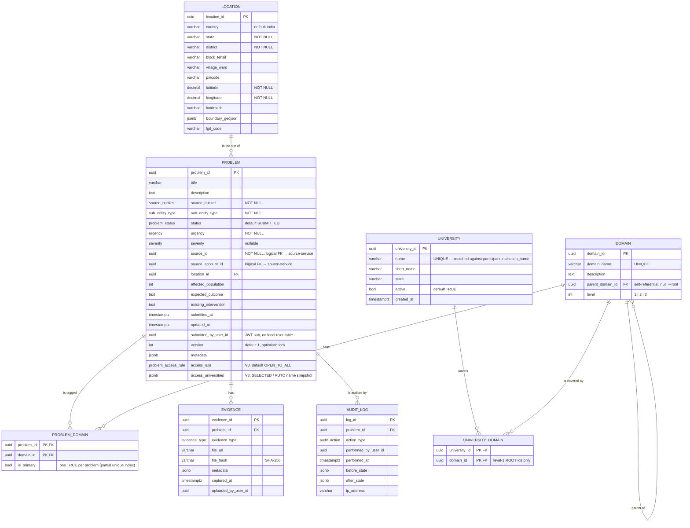
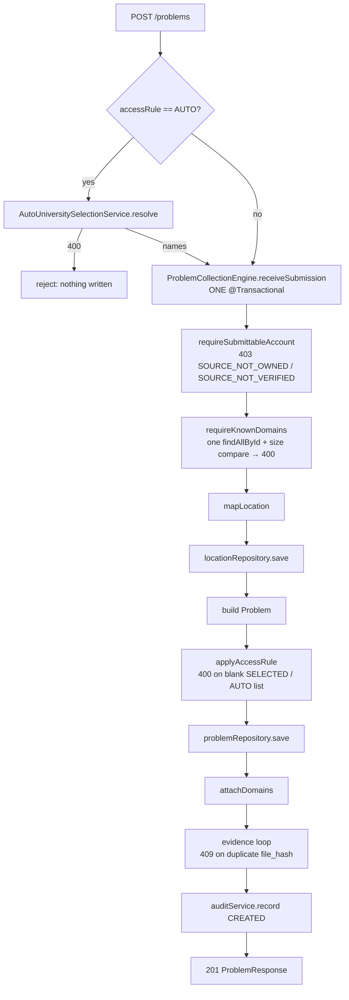
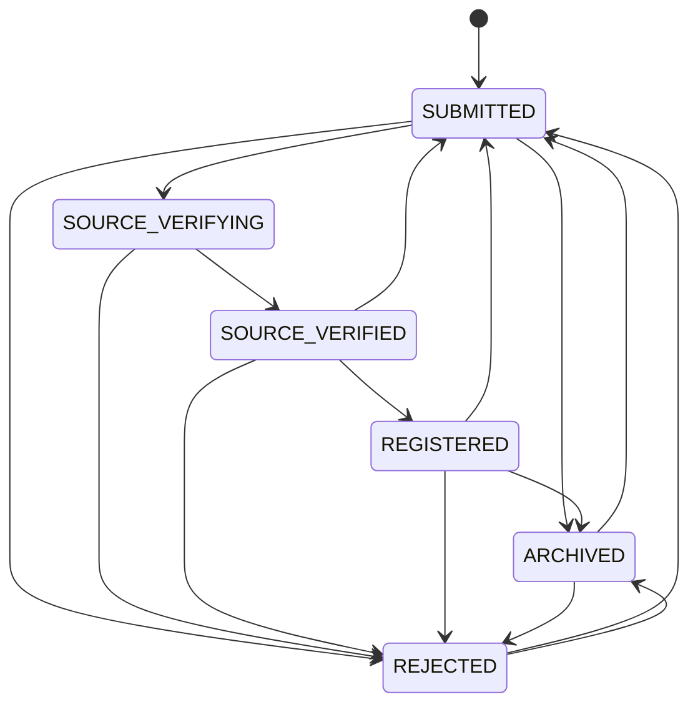
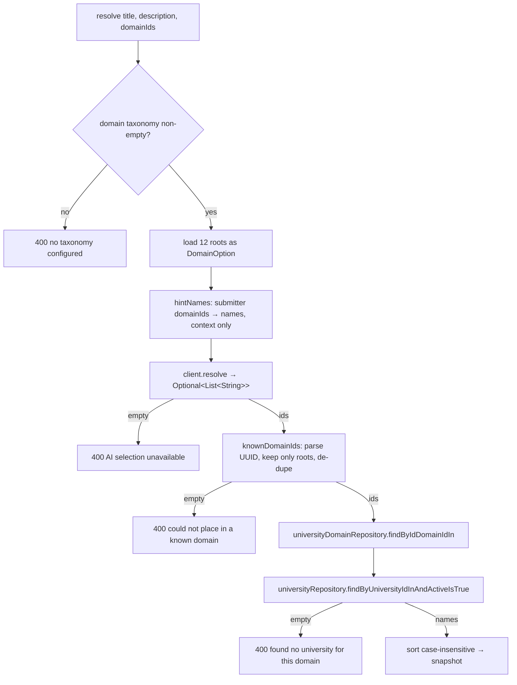
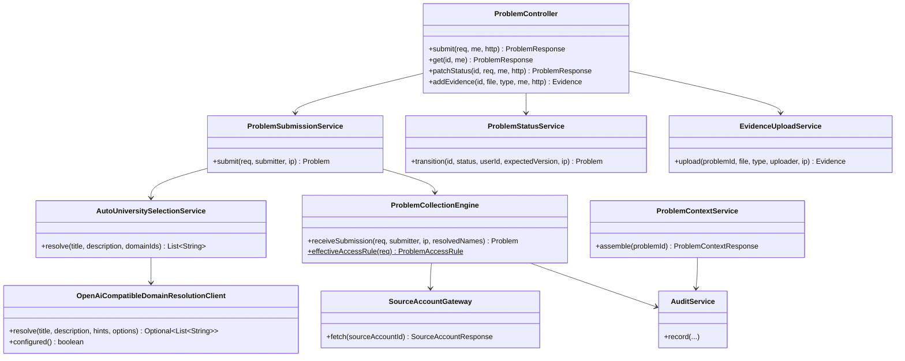
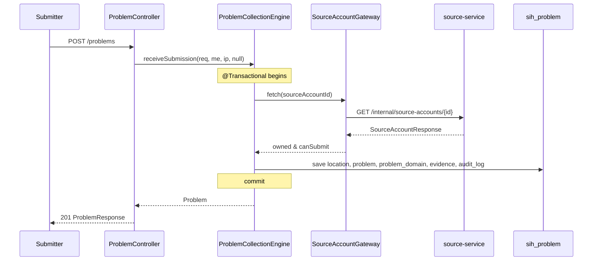
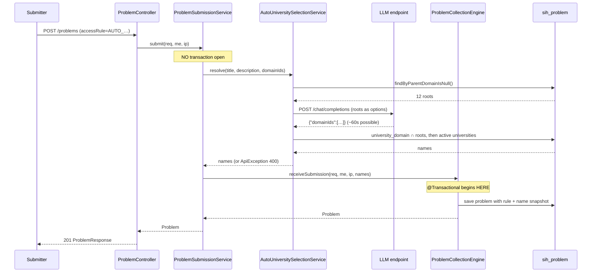

# SIH26043 — Problem Service: design & reference notes

> The **problem aggregate**. Everything that defines *what a problem statement is* lives here:
> the submitter's `POST /problems` intake, the location it happened at, the domain taxonomy it is
> filed under, the evidence attached to it, the reviewer/admin status workflow, the append-only
> audit trail, and the access rule that decides **which universities are allowed to see it**.
>
> It owns one database — `sih_problem` — and reaches every other service over HTTP.
> **No other service reads `sih_problem` and problem-service reads no other service's DB.**
>
> This file is the reference for everything problem-service does: architecture & integration,
> data model (ER), flowcharts, UML (class + sequence), the full HTTP surface, internal service
> contracts, security, the AI domain-resolution step behind the automatic access rule, and
> deployment wiring. It mirrors the style of `evaluation-service.md` / `portalservice.md` /
> `codejudgeservice.md` and stays true to the committed code.

---

## 1. What this service is

problem-service is the **write-side system of record for a problem statement**. A problem is born
here, moves through its verification/registration lifecycle here, and is handed to
evaluation-service once it reaches `REGISTERED`. Concretely it does six things:

1. **Intake** — `POST /problems` takes a submitted problem (title, description, urgency/severity,
   affected population, expected outcome, existing intervention), the *evidence* recorded about it,
   and a structured `location`. It resolves all of that into one atomic write.
2. **Ownership & eligibility gate** — before a problem is created it calls source-service
   (`GET /internal/source-accounts/{id}`) to prove the chosen `sourceAccountId` is owned by the
   caller and is still allowed to act (`canSubmit`). The problem stores the account's UUID plus the
   `source_bucket` and `sub_entity_type` **derived from the account response** — those two columns
   are NOT NULL and are *not* client-supplied, so a caller cannot mislabel itself.
3. **Domain classification** — a problem is tagged with zero or more nodes of the three-level
   domain taxonomy (`domain`, self-referential, seeded by Flyway V2). These tags are what
   evaluation-service and codejudge-service later use to pick evaluators.
4. **Lifecycle** — a versioned state machine (`ProblemStatus`) advanced by a reviewer/admin via
   `PATCH /problems/{id}/status`, with an optimistic-lock check so two concurrent decisions cannot
   both win.
5. **Audit** — every create and every status change appends an `audit_log` row in the *same*
   transaction as the change it records. There are exactly **two** write sites:
   `ProblemCollectionEngine` (the `CREATED` row) and `ProblemStatusService`
   (`STATUS_CHANGED` / `REJECTED` / `ARCHIVED`). **Evidence upload is not audited** — see §7.
6. **Audience** — each problem carries a `ProblemAccessRule` and, for the two snapshot rules, the
   list of university *names* allowed to see it. This is the field portal-service reads when it
   decides whether a student/university may browse a published problem.

### Where it sits

```
        submitter / reviewer / admin
                    │
                    ▼
        ┌───────────────────────┐
        │   Caddy gateway :8080 │
        └───────────┬───────────┘
                    │  /problems  /domains  /audit
                    ▼
        ┌─────────────────────────────────────────────┐
        │  problem-service :8082   (sih_problem)      │
        │                                             │
        │  intake ─ lifecycle ─ audit ─ domains       │
        │  + AUTO access-rule resolver                │
        └───────┬──────────────────────┬──────────────┘
                │                      │
   GET /internal/source-accounts/{id} │  POST /internal/published-problems   (portal-service
                │                      │  GET  /internal/problems/{id}        ← evaluation-service,
                ▼                      ▼                                       codejudge-service)
        source-service :8081      evaluation... / portal-service :8084
```

### The service-to-service arrows

| Direction | Arrow | Why |
|---|---|---|
| problem → source | `GET /internal/source-accounts/{id}` | Ownership + `canSubmit` verification at intake. The **only** outbound call on the normal path. |
| problem → model | `POST {base-url}/chat/completions` (OpenAI-compatible) | Domain resolution for the `AUTO_SELECTED_UNIVERSITIES` access rule only. Skipped entirely for the other three rules. |
| problem ← evaluation | `GET /internal/problems/{id}` | Returns the `ProblemContextResponse` snapshot evaluation-service scores against. Unauthenticated, service-to-service. |
| problem ← portal | *(nothing)* | Portal does not call problem-service at all; it receives the problem as a *push* from evaluation-service at `EVALUATION_COMPLETED`. |
| problem ← codejudge | `GET /internal/problems/{id}` | Same context snapshot, used to fetch the problem a repository submission claims to solve. |

> **Note:** `/internal/**` is **not** routed through the Caddy gateway. It is reachable only
> pod-to-pod inside the compose network.

### Why a separate service

The problem aggregate has the widest fan-in of any service in the stack — evaluation, portal and
code-judge all need its context snapshot, and every later stage keys off the problem's status and
domains. Extracting it (strangler step 2 of the microservices conversion) gave it one schema, one
Flyway history and one deploy unit, so a problem-schema change no longer risks the evaluation or
portal tables. Cross-service referential integrity was deliberately traded for plain UUID columns:
the alternative — one shared DB with cross-service FKs — reintroduces the coupling the split
exists to remove.

### Locked decisions

| # | Decision |
|---|---|
| 1 | **Source-service is the only authority on source accounts.** problem-service stores `source_account_id` and `source_id` as bare UUIDs and never replicates account data. |
| 2 | **The domain taxonomy is seeded, not user-managed.** 44 nodes (12 roots / 26 level-2 / 6 level-3) come from Flyway V2 and are read-only at runtime. |
| 3 | **The audit trail shares the caller's transaction.** `AuditService` uses `REQUIRED`, never `REQUIRES_NEW` — a separate transaction would break `audit_log_problem_id_fkey` for a brand-new problem and could record a change that then rolled back. |
| 4 | **Access rules are fail-closed.** `SELECTED_UNIVERSITIES` with an empty list is a 400; `AUTO_SELECTED_UNIVERSITIES` that cannot be resolved is a 400. The audience is never silently widened or narrowed. |
| 5 | **The AI never names a university.** For the automatic rule the model maps text → domain ids; the university match is a deterministic Java set-intersection over a seeded catalog. |
| 6 | **AI-resolved domains are transient.** They route the problem but are *not* written to `problem_domain`; that would change evaluation-service's domain context for a routing-only feature. |
| 7 | **Evidence lives on disk, its hash in the DB.** Files are stored under `app.evidence.storage-dir`, keyed by a random UUID prefix; `file_hash` (SHA-256) is the global dedupe key. |

---

## 2. Tech stack & configuration

| Concern | Choice |
|---|---|
| Runtime | Java 21, Spring Boot 4.1.1 |
| Build | Maven multi-module (`./mvnw`), module `problem-service`; jar also aggregates `edith-common` |
| Web | Spring MVC (`spring-boot-starter-web`) + Bean Validation |
| Security | Spring Security, stateless JWT, `@EnableMethodSecurity` |
| Persistence | Spring Data JPA / Hibernate, PostgreSQL 16 (`postgis/postgis:16-3.4`) |
| Migrations | Flyway, `classpath:db/migration`, `ddl-auto: validate` |
| Discovery | Eureka client (`sih26043-eureka`, port 8761) |
| LLM | `RestClient` (JDK `HttpURLConnection` factory), Jackson 3 `tools.jackson.databind.ObjectMapper` |
| Docs | springdoc-openapi (Swagger UI) |

`problem-service/src/main/resources/application.yaml`, verbatim in structure:

```yaml
spring:
  application.name: problem-service
  datasource:
    url: ${DB_URL:jdbc:postgresql://localhost:5432/sih_problem}
    # hikari maximum-pool-size: 10   ← the constraint the AUTO resolver is designed around
  jpa:
    open-in-view: false
    hibernate.ddl-auto: validate
    properties.hibernate.jdbc.time_zone: UTC
  flyway.locations: classpath:db/migration
  servlet.multipart:
    max-file-size: 50MB
    max-request-size: 55MB
server.port: 8082

app:
  jwt:
    secret: ${JWT_SECRET:}
    issuer: sih26043
    ttl: 15m
  evidence.storage-dir: ${EVIDENCE_STORAGE_DIR:./data/evidence}
  source-service.base-url: ${SOURCE_SERVICE_URL:http://source-service}
  llm.openai:
    api-key: ${OPENAI_API_KEY:}                 # blank ⇒ AUTO always fails closed (by design)
    base-url: ${OPENAI_BASE_URL:http://localhost:20128/v1}
    model: ${OPENAI_MODEL:agentrouter/deepseek-v4-flash}
    max-tokens: 8192                            # headroom: reasoning tokens are billed first,
                                                # so 4k can be spent entirely on thinking
    timeout-seconds: 60
    # max-retries (1), temperature (0.2) and json-response-format (true) are NOT in the yaml —
    # they are the client's @Value defaults and only appear here if overridden.

eureka.client.service-url.defaultZone: ${EUREKA_SERVER_URL:http://localhost:8761/eureka}
eureka.instance.prefer-ip-address: true
```

**The one non-obvious config choice.** `app.llm.openai.api-key` defaults to **empty on purpose**.
Under locked decision #4 an unconfigured model must produce a `400`, not a fallback audience, so
"no key" is a supported (if degraded) state rather than a startup failure. The compose file passes
`OPENAI_API_KEY: ${OPENAI_API_KEY:-}` — the real key lives in the gitignored `.env` at the repo
root and is never written into a tracked file.

---

## 3. Data model (`sih_problem`)

### 3.1 ER diagram



### 3.2 Tables at a glance

| Table | Owns | Notes |
|---|---|---|
| `location` | The geographic site of a problem | `country` (default `India`), `state`, `district` mandatory; `block_tehsil`, `village_ward`, `pincode`, `landmark`, `boundary_geojson`, `lgd_code` optional; `latitude`/`longitude` are plain `DECIMAL` and **NOT NULL**. **No PostGIS column and no trigger** — the original `geo_coordinates` column and its sync trigger were intentionally dropped in the microservices conversion (documented in the V1 header). Indexed on `lgd_code` and `(latitude, longitude)`. |
| `domain` | The fixed taxonomy | Self-referential via `parent_domain_id` (self-parent forbidden by a CHECK). `level` 1–3. `domain_name` is UNIQUE. Read-only at runtime. |
| `problem` | The aggregate root | `source_bucket`/`sub_entity_type`/`urgency` are NOT NULL, `severity` nullable, `status` defaults to `SUBMITTED`. `@Version Integer version` starts at 1 → drives optimistic locking and the `expectedVersion` precondition on status changes. `access_rule` and `access_universities` are the audience (see §9). **`metadata` JSONB is a dead column** — nothing calls `problem.setMetadata(...)` and `ProblemResponse` has no such field (the `metadata` writes that exist are on *evidence*, not problems). |
| `problem_domain` | Problem ↔ domain tags | Composite PK `(problem_id, domain_id)` plus `is_primary`; a **partial unique index** (`WHERE is_primary = TRUE`) enforces at most one primary domain per problem. Deleting a problem cascades. |
| `evidence` | Attachments / records | `file_url` is a server-side path for uploads, or a caller-supplied URL for a metadata-only record; `file_hash` (SHA-256, `VARCHAR(64)`) is the dedupe key. `uploaded_by_user_id` is a plain UUID. |
| `audit_log` | Append-only trail | PK is `log_id`; the action column is `action_type` (the Java field is `actionType`), a `NamedEnum`-encoded `AuditAction`. `before_state` / `after_state` are JSONB snapshots. `problem_id` is nullable and cascades. |
| `university` + `university_domain` | The **seeded routing catalog** (see §3.4) | New in V5. Exists solely so `AUTO_SELECTED_UNIVERSITIES` has something to match against. |

There is no `evaluation_feedback` table: scorecards stay in evaluation-service / codejudge-service;
problem-service's `ProblemContextResponse` is the only thing those services read from here.

### 3.3 Enums (Postgres native `CREATE TYPE`)

| Type | Values | Used by |
|---|---|---|
| `source_bucket` | `GOVT`, `CITIZEN`, `INDUSTRY`, `COMMUNITY`, `HEI` | `problem.source_bucket` |
| `sub_entity_type` | `DEPARTMENT`, `PRI`, `ULB`, `INDIVIDUAL`, `RWA`, `COMPANY`, `STARTUP`, `MSME`, `CSR`, `NGO`, `SHG`, `CBO_COOP`, `UNIVERSITY`, `RESEARCH_LAB` | `problem.sub_entity_type` |
| `problem_status` | `SUBMITTED`, `SOURCE_VERIFYING`, `SOURCE_VERIFIED`, `REGISTERED`, `REJECTED`, `ARCHIVED` | `problem.status` |
| `urgency` | `IMMEDIATE`, `SHORT_TERM`, `LONG_TERM` | `problem.urgency` |
| `severity` | `CRITICAL`, `HIGH`, `MEDIUM`, `LOW` | `problem.severity` |
| `evidence_type` | `PHOTO`, `VIDEO`, `DOCUMENT`, `AUDIO`, `DATASET`, `LOCATION_PIN` | `evidence.evidence_type` |
| `audit_action` | `CREATED`, `UPDATED`, `STATUS_CHANGED`, `EVIDENCE_ADDED`, `SOURCE_VERIFICATION_INITIATED`, `SOURCE_VERIFIED`, `SOURCE_VERIFICATION_FAILED`, `REJECTED`, `ARCHIVED`, `WITHDRAWN`, `EVALUATION_*` (12 more) | `audit_log.action_type` |
| **`problem_access_rule`** | **`OPEN_TO_ALL`, `UNIVERSITY_ONLY`, `SELECTED_UNIVERSITIES`, `AUTO_SELECTED_UNIVERSITIES`** | `problem.access_rule` |

`audit_action` in the DB carries **21** labels — the 10 Phase-1 actions plus 11 `EVALUATION_*`
actions. The Java enum `AuditAction` in edith-common has **27** constants: six newer Phase-3/4
values (`PROBLEM_PUBLISHED`, `PROJECT_REVIEW_ASSIGNED`, `PROJECT_REVIEW_DECIDED`,
`EVALUATION_AI_SCORED`, `EVALUATION_AI_UNAVAILABLE`, `EVALUATION_MODE_CHANGED`) have **no DB label
at all**. The two lists therefore do *not* agree, and persisting one of those six here would fail at
runtime. It is latent only because problem-service writes just `CREATED`, `STATUS_CHANGED`,
`REJECTED` and `ARCHIVED` — those four are all in the DB type. (Other services write the rest into
their own schemas.) `problem_access_rule` is declared **twice in the stack** — once

here and once in `sih_portal` as `access_rule`. They are independent `CREATE TYPE`s; both must know
every value. See §9.

### 3.4 The university catalog (V5)

`AUTO_SELECTED_UNIVERSITIES` needs a set of institutions to route *to*. `source-service.hei_source`
was not usable for this (it carried no domain column), so the catalog is **seeded inside
problem-service**:

- **16 universities** with registered-style full names, deterministic UUIDs
  `30000000-0000-4000-8000-…0001`–`…0010`.
- **34 `university_domain` links**, each tagged to **level-1 root domains only**.
- **Every one of the 12 roots has ≥1 active university**, so no root can dead-end in a 400.
- Seeded with `ON CONFLICT DO NOTHING` so re-running is safe.

Roots-only tagging is deliberate: the model is given the 12 roots, so tagging level-2/3 ids would
make the intersection silently empty. This removes hierarchy logic from the match entirely — it is
a flat set intersection.

Two schema notes: **nothing enforces the roots-only rule** — it is upheld by the seed and by the
resolver's root filtering, not by a constraint, so a hand-inserted level-2 tag would simply never
match. And `university.university_id` has **no DB default** (unlike every other PK here) and the
entity has no `@PrePersist`, so inserts must supply an id — fine for the seed, a trap for future
CRUD. There is no admin CRUD or write path for this catalog at all: it is seed-only and read-only.

> **Known seam.** Matching against a participant is exact-normalized (`trim` + lowercase + collapse
> whitespace) on `participant.institution_name`. A catalog name must equal what the HEI registers
> as its institution name, or that university cannot see its own routed problem. No fuzzy matching
> or alias table exists — a documented limitation, not a bug.

### 3.5 Flyway migrations

| File | Contents |
|---|---|
| `V1__problem_schema.sql` | All enums + `location`, `domain`, `problem`, `evidence`, `problem_domain`, `audit_log`. Header records the conversion decisions: cross-service FKs became plain UUIDs, and the PostGIS column + trigger were **dropped**. |
| `V2__domain_seed.sql` | The 3-level domain taxonomy, deterministic UUIDs (`00000000-0000-4000-8000-…0001`–`…000C` for the 12 roots). |
| `V3__problem_access_rule.sql` | `CREATE TYPE problem_access_rule`; `problem.access_rule` (NOT NULL, default `OPEN_TO_ALL`) and `problem.access_universities` JSONB (NOT NULL, default `[]`). |
| `V4__auto_selected_universities_rule.sql` | `ALTER TYPE problem_access_rule ADD VALUE IF NOT EXISTS 'AUTO_SELECTED_UNIVERSITIES';` — **alone in the file**, because since PG12 a new enum value cannot be *used* in the transaction that adds it. |
| `V5__university_catalog.sql` | `university` + `university_domain` DDL and the 16-university / 34-link seed. |

> **Never edit an applied migration.** Flyway validates checksums at startup; edit one and every
> service refuses to boot. New behavior always goes in a new, higher-numbered file.

---

## 4. Flowcharts

### 4.1 Submission intake (`POST /problems`)



The `AUTO` branch runs **outside any transaction** — that is the whole reason
`ProblemSubmissionService` exists as a separate bean. See §10.

### 4.2 Status state machine

Allowed transitions (`ProblemStatusService.ALLOWED`):



A `PATCH` is rejected with:

| Condition | Status | Message |
|---|---|---|
| `expectedVersion` ≠ current `version` | 409 | `Stale version X; expected Y` |
| target status == current status | 400 | `Already in status X` |
| transition not in the map | 400 | `Illegal transition A -> B` |

The audit action is `REJECTED` / `ARCHIVED` / `STATUS_CHANGED` depending on the target.

`REGISTERED` is the hand-off point: evaluation-service begins its cycle from a `REGISTERED` problem.

**Nothing advances the status automatically.** No internal client patches this endpoint and no
scheduler moves a row. `SOURCE_VERIFYING` → `SOURCE_VERIFIED` → `REGISTERED` are all just
reviewer/admin actions — "source verifying" is a label, not a workflow that a worker drives.

`expectedVersion` is **optional**, so the optimistic-lock precondition can be skipped by omitting it;
and there is no handler for a Hibernate optimistic-locking failure, so the only stale-write 409 is
the explicit pre-check. `WITHDRAWN` exists in the audit vocabulary and the service comment on
`REJECTED → SUBMITTED` talks about a submitter withdrawing, but the only status endpoint is
`REVIEWER`/`ADMIN`-gated — **a submitter cannot self-withdraw**.

### 4.3 Automatic audience resolution



Every terminal failure is a **400 with an actionable message** telling the submitter to choose
another access rule. Every dropped model id is logged (`Dropping non-UUID domain id…` /
`Dropping domain id outside the seeded taxonomy…`) — the same "a hallucinated item is dropped, not
fatal" precedent the scoring clients use, so a partly-usable answer still routes.

---

## 5. UML

### 5.1 Classes



### 5.2 Sequence — a plain submission (rule ≠ AUTO)



### 5.3 Sequence — an `AUTO_SELECTED_UNIVERSITIES` submission



---

## 6. HTTP surface

### Public (through the gateway, `/problems`, `/domains`, `/audit` → problem-service)

| Method & path | Auth | Success | Notes |
|---|---|---|---|
| `POST /problems` | any authenticated | **201** `ProblemResponse` | The single intake endpoint. |
| `GET /problems/{id}` | authenticated | 200 `ProblemResponse` | 404 if missing. A `SUBMITTER` may only fetch **their own** problem, else 403 `Not your submission`. |
| `PATCH /problems/{id}/status` | `REVIEWER` or `ADMIN` | 200 `ProblemResponse` | Body `{status, expectedVersion}`. See §4.2 for the 400/409 cases. |
| `POST /problems/{id}/evidence` | authenticated | 200 `Evidence` | `multipart/form-data`: `file` (required) + `evidenceType` (default `DOCUMENT`). Same own-problem check as `GET`. |
| `GET /domains` | **public** (`permitAll`) | 200 `List<Domain>` | The 12 root domains, each with its `children` tree built in memory. Cached by the client. |
| `GET /audit/{problemId}` | `REVIEWER` or `ADMIN` | 200 `List<AuditLog>` | Ordered `performedAt` ascending. |

### Internal (not gateway-routed)

| Method & path | Auth | Returns |
|---|---|---|
| `GET /internal/problems/{id}` | none | `ProblemContextResponse` — the frozen snapshot evaluation-service and codejudge-service consume. 404 if unknown. Marked `@Hidden` in Swagger. |

**No endpoint lists problems.** Browsing a *published* problem is portal-service's job; problem-service
has no browse-all route, which is why the access rule is enforced on the read side there.

Other absences on this surface: **no `GET /problems` collection** (only `POST` and `GET /{id}`), no
`PUT` or `DELETE` anywhere, and **no pagination, filtering or sorting** on any route — `GET /domains`
returns the whole tree and `GET /audit/{problemId}` the whole history unfiltered. There is also no
read route for a location, a problem's domain tags, or an evidence list. `405` / `415` / `413` have
no dedicated handlers: they fall through to the catch-all (500) unless Spring raises them as an
`ErrorResponse` with its own non-500 status.

### Request DTOs

`ProblemSubmitRequest`:

| Field | Validation | Notes |
|---|---|---|
| `title` | `@NotBlank` | |
| `description` | `@NotBlank` | The text the AI classifier reads. |
| `urgency` | `@NotNull` | |
| `severity`, `affectedPopulation`, `expectedOutcome`, `existingIntervention` | optional | |
| `sourceAccountId` | `@NotNull` | Verified against source-service. |
| `location` | `@Valid @NotNull` | Nested `LocationRequest`. |
| `domainIds` | optional | Tags written to `problem_domain`; also the (non-binding) AI hint for AUTO. |
| `evidence` | optional | Nested `EvidenceRequest` list; each needs `evidenceType`, `fileUrl`, `fileHash`. |
| `accessRule` | optional | `null` ⇒ `OPEN_TO_ALL`. |
| `accessUniversities` | optional | **Read only by `SELECTED_UNIVERSITIES`.** Silently ignored for the other three — including AUTO, where the server resolves it. |

> No custom constraint messages exist, so every `fieldErrors` value is the Hibernate Validator
> default (`must not be blank`, `must not be null`). There is no class-level `@Validated`; nested
> validation relies on the `@Valid` on the `location` / `evidence` fields.

`LocationRequest`: `state` `@NotBlank`, `district` `@NotBlank`, `latitude` `@NotNull`,
`longitude` `@NotNull`; optional `blockTehsil`, `villageWard`, `pincode`, `landmark`, `lgdCode`.

`StatusPatchRequest`: `status` `@NotNull`, `expectedVersion` optional (omitted ⇒ no optimistic check).

### Response shape

`ProblemResponse.from(Problem)` is a flat 20-field projection, with these defensive defaults so an
old row can never NPE the mapper: `accessRule` → `OPEN_TO_ALL`, `accessUniversities` → `[]`,
`version` → `1`. The fields are `problemId`, `title`, `description`, `sourceBucket`,
`subEntityType`, `status`, `urgency`, `severity`, `sourceId`, `sourceAccountId`, `locationId`,
`affectedPopulation`, `expectedOutcome`, `existingIntervention`, `submittedAt`, `updatedAt`,
`submittedByUserId`, `accessRule`, `accessUniversities`, `version`.

> Note what it does **not** return: there is no nested location object, no `domainIds` and no
> `metadata`. The response carries `locationId` only. **There is no public read path for any of
> them** — the service exposes no GET for a location, no route that returns a problem's domain tags,
> and no evidence listing (only the POST, which echoes back the file just uploaded). After intake,
> location, domain tags and evidence are effectively **write-only** through the public API; domain
> names reappear only in the internal `ProblemContextResponse`.

The `clientIp` helper on the controller reads the **first** entry of `X-Forwarded-For` (falling back
to `getRemoteAddr()`), so the audit trail records the real submitter IP behind Caddy.

---

## 7. Internal contracts & error mapping

### `ProblemContextResponse` (edith-common, 16 fields)

The wire contract between problem-service and its consumers. Enum-ish fields are emitted as
`name()` strings with null guards, and `accessUniversities` defaults to `[]`. Its javadoc documents
that the field carries the name snapshot for **both** `SELECTED_UNIVERSITIES` and
`AUTO_SELECTED_UNIVERSITIES`.

### `SourceAccountGateway`

| Upstream result | problem-service returns |
|---|---|
| 404 | 404 `Source account not found` |
| any other error | 502 `Source service error (N) while fetching source account X` |
| `RestClientException` | 503 `Source service unreachable; cannot verify source account X` |

The client proxy (`SourceAccountClientConfig`) is deliberately **not** a `@LoadBalanced
RestClient.Builder` bean: Eureka's own transport auto-wires such a bean and would then try to
discover the registry through the registry (circular). Instead a scoped
`DiscoveryResolvingInterceptor` resolves the service id per request via `LoadBalancerClient`.
Timeouts: 2 s connect, 5 s read.

The engine then does `SourceBucket.valueOf(account.sourceBucket())` /
`SubEntityType.valueOf(account.sourceType())`. A value source-service returns that this service's
enums do not know would surface as an `IllegalArgumentException` → **500**, not a 400 — correct,
since it is an upstream contract break rather than a caller mistake.

### Error envelope (all services share it)

`GlobalExceptionHandler` returns RFC-7807 `ProblemDetail` with `type: about:blank`:

| Exception | Status | Body |
|---|---|---|
| `ApiException` | its own status | `detail` = the message |
| `AccessDeniedException` | 403 | `Insufficient role for this operation` |
| `MethodArgumentNotValidException` | 400 | `Validation failed` + `fieldErrors` map |
| `HttpMessageNotReadableException` | 400 | `Malformed or invalid request body` |
| `MethodArgumentTypeMismatchException` | 400 | `Invalid value for parameter 'X'` |
| anything else | 500 | `Unexpected error: <SimpleName>` |

### Engine error messages (the contract for tests)

| Status | Message |
|---|---|
| 403 | `SOURCE_NOT_OWNED: this source account belongs to another user` |
| 403 | `SOURCE_NOT_VERIFIED: source account is …/…` |
| 400 | `Unknown domain(s): …` (one `findAllById` + size compare, **before** any write) |
| 400 | `accessRule=SELECTED_UNIVERSITIES requires a non-empty accessUniversities list of university names` |
| 400 | `accessRule=AUTO_SELECTED_UNIVERSITIES requires the audience to be resolved by the server; none was supplied` |
| 409 | `Duplicate evidence: file_hash already on file` (intake) / `Duplicate evidence: identical file already exists` (upload endpoint) |

### Audit coverage — what is *not* audited

The `audit_log` type advertises 21 actions but the service emits only four. In particular:

- **`POST /problems/{id}/evidence` writes no audit row.** `EvidenceUploadService` even injects
  `AuditService` but never calls `record(...)` — a dead injection. A file upload is therefore
  invisible to `GET /audit/{problemId}`, which matters for any chain-of-custody expectation.
- `EVIDENCE_ADDED` and `WITHDRAWN` exist as enum labels and are advertised in
  `AuditController`'s OpenAPI description as actions of the returned history, but **no code path
  emits either** here. (See §13.)
- The `AuditService` `Map` overload documented as the "evaluation engine" path has **zero callers**
  in this service.

Validation order matters and is intentional: the domain-existence check was **hoisted** ahead of
`locationRepository.save`, and `applyAccessRule` runs before the problem insert, so a 400 never
leaves an orphan `location` row. (`receiveSubmission` is one transaction, so nothing survives a
throw regardless — the hoist just makes the failure cheap and the intent explicit.)

---

## 8. Security

`SecurityConfig`:

- **Stateless** — `SessionCreationPolicy.STATELESS`, CSRF disabled, JWT bearer auth.
- **`permitAll`**: `OPTIONS /**`, `GET /domains`, the Swagger/OpenAPI paths, `/error`, and
  **`/internal/**`**.
- **Everything else** `authenticated()`.
- `JwtAuthFilter` runs before `UsernamePasswordAuthenticationFilter`; `@EnableMethodSecurity` makes
  `@PreAuthorize` (used on `PATCH /problems/{id}/status` and `GET /audit/{problemId}`) effective.
- JWT is issued elsewhere with issuer `sih26043`, 15-minute TTL, secret from `JWT_SECRET`.
- `AuthUser` (an `AuthenticationPrincipal`) carries `userId`, `phone`, `role`, `kycStatus`.

**Ownership is a service-layer concern, not a role check.** A `SUBMITTER` passes the role gate on
`GET /problems/{id}` and `POST /problems/{id}/evidence` and is then checked against
`problem.submittedByUserId`. **Every other authenticated role** — `REVIEWER`, `ADMIN`, `EVALUATOR` —
bypasses that check and may read *any* problem or upload evidence to *any* problem.

**`POST /problems` has no `@PreAuthorize`.** It is open to every authenticated role, not just
`SUBMITTER`; the real gate is downstream (`SOURCE_NOT_OWNED` / `SOURCE_NOT_VERIFIED` against the
source account), so a reviewer who happens to own a submittable account can submit. The same is true
of the evidence endpoint.

`/internal/**` is unauthenticated by design and safe only because the gateway does not route it —
it is reachable solely inside the compose network. Anything exposed there must be considered
service-trusted input.

**401s do not use the RFC-7807 envelope.** Authentication failures are written by the
`AuthenticationEntryPoint` (`res.sendError(401, "Unauthorized")`), which bypasses
`GlobalExceptionHandler`; the body is the servlet-container error dispatch, shaped differently from
every other error this service returns. Only *authorization* failures (a denied `@PreAuthorize`)
go through the handler and come back as a 403 `ProblemDetail`.

### CORS

`config/CorsConfig.java` is `@Profile("!prod")` — **dev-only**. It allows all origin patterns, all
common methods and all headers, with `allowCredentials=false` and a 3600 s preflight cache, and
registers on `/**`. It exists so `test-ui/index.html` (opened straight from disk or any localhost
port) can call the API through the gateway; `SecurityConfig` picks it up via
`.cors(Customizer.withDefaults())` because the bean is named `corsConfigurationSource`. Under the
`prod` profile there is no CORS policy at all.

It also sets `exposedHeaders: ["Location"]` — **dead config**, because no endpoint sets a `Location`
response header (`POST /problems` returns 201 via `@ResponseStatus` only).

---

## 9. Access rules & visibility

`ProblemAccessRule` (edith-common) has four values:

| Value | Audience | `accessUniversities` |
|---|---|---|
| `OPEN_TO_ALL` | every student and university | empty |
| `UNIVERSITY_ONLY` | every university, no students | empty |
| `SELECTED_UNIVERSITIES` | exactly the universities the submitter named | the name list |
| `AUTO_SELECTED_UNIVERSITIES` | exactly the universities the server resolved | the resolved name list |

The audience for the two "named" rules is a **JSONB list of university names** stored on the problem
row — a self-contained snapshot, not a join. Portal's `ParticipantService.canSee` compares it to
`participant.institution_name` with the shared normalization (`trim` + lowercase + collapse runs of
whitespace). A university with no institution snapshot, or a snapshot that matches no name, sees
nothing under these rules — which is exactly why an **empty** list is a 400 at intake rather than a
legitimate "visible to nobody".

| Rule | STUDENT sees | UNIVERSITY sees |
|---|---|---|
| `OPEN_TO_ALL` | ✅ | ✅ |
| `UNIVERSITY_ONLY` | ❌ | ✅ |
| `SELECTED_UNIVERSITIES` | ❌ | only if named |
| `AUTO_SELECTED_UNIVERSITIES` | ❌ | only if named in the resolved snapshot |

`ParticipantService.canSee` is the only **exhaustive `switch`** over this enum in the repo, so adding
a value breaks compilation there — a deliberate safety net. Portal widens the existing arm
(`case SELECTED_UNIVERSITIES, AUTO_SELECTED_UNIVERSITIES ->`); the matching body is identical.

> ⚠️ **Cross-service invariant.** The enum is materialized as a Postgres type in *both*
> `sih_problem` (`problem_access_rule`) and `sih_portal` (`access_rule`). Portal's
> `PublishedProblemService.enumOf` returns `null` for a name it does not recognise and the caller
> then defaults the rule to `OPEN_TO_ALL` — so a missing portal migration turns a restricted
> problem into one open to everyone. That is a **leak, not an error**. problem-service and
> portal-service must always deploy together whenever this enum changes.

The snapshot is sorted case-insensitively at resolution time, so the stored list does not depend on
repository row order.

**Two properties of the snapshot worth knowing:**

- It stores **name strings, not ids**. There is no `university_id` column on `problem` and no FK
  linking a problem to `university` — only the JSONB list, which is why portal-service can match it
  by string against `participant.institution_name` without calling back here.
- For `SELECTED_UNIVERSITIES` the names are **not validated against any registry**. The submitter
  hand-types them and arbitrary strings are persisted verbatim; a typo simply means nobody can see
  the problem. Only the automatic rule is backed by the seeded catalog.

---

## 10. The AI domain-resolution client

`OpenAiCompatibleDomainResolutionClient` follows the evaluation-service recipe exactly:

- All-`@Value` constructor; lazy `volatile RestClient` over `SimpleClientHttpRequestFactory`
  (5 s connect, read = `timeout-seconds`).
- Body: `model`, `messages`, `temperature`, `max_tokens`, `stream: false` (explicit — some routers,
  including the local one, otherwise stream SSE), and `response_format: {"type":"json_object"}`.
- `maxRetries` with attempts = `max(1, retries + 1)`; markdown fences are stripped before parsing.
- **Never throws to the caller** — every failure ends as `Optional.empty()`. A present-but-empty
  `domainIds` list is a *different* answer (the model replied but named no domain) and the caller
  distinguishes the two.
- `configured()` is false when the key is blank, in which case it logs and returns empty with no
  HTTP call at all.

Prompt contract: title + description always; the submitter's `domainIds` are passed as
**suggested context only** (never a constraint, never a seed for the answer, no required overlap);
the 12 roots are supplied as `{domainId, domainName, description}` options. The system prompt asks
for `{"domainIds":[...]}`, 1–3 ids most relevant first, verbatim from the list, `[]` if too vague,
and explicitly forbids scoring/ranking/recommending.

**Cost/latency note.** The call can take ~60 s. It is deliberately executed with **no transaction
open** (`ProblemSubmissionService`, not the engine) so a Hikari connection from the pool of 10 is
not pinned for a minute per in-flight submission. Splitting the orchestrator into its own bean also
means the engine call is a genuine cross-bean call, so the `@Transactional` proxy actually applies
(a self-invocation would silently bypass it).

Two boundaries the code does **not** enforce: the prompt's "choose 1 to 3 ids" is a request, not a
constraint — every known id the model returns is kept, however many there are; and the answer is
never cached, so one AUTO submission means exactly one model call. Resilience is limited to the
client's `max-retries` plus the connect/read timeouts — there is no circuit breaker here or anywhere
in the stack.

One asymmetry in what is hoisted: the **model** call is pulled out of the transaction, but the
**source-account** HTTP call is not. `requireSubmittableAccount` still runs inside
`receiveSubmission`, so a slow source-service holds a pooled connection for up to the 5 s read
timeout. That is bounded, unlike the 60 s model call.

---

## 11. Deployment wiring

- **Dockerfile**: `Dockerfile.service` — a thin wrapper that copies one pre-built fat jar. It takes
  `ARG JAR_FILE` with no default, so the compose build supplies the built module jar.
- `.dockerignore` excludes `**/target/*` then re-includes each service's jar.
- **Compose block** (`problem-service`): `SERVER_PORT=8082`,
  `DB_URL=jdbc:postgresql://db:5432/sih_problem`, `SOURCE_SERVICE_URL`, `EUREKA_SERVER_URL`,
  `OPENAI_API_KEY: ${OPENAI_API_KEY:-}` (with a comment that an empty key is *not* a safe fallback
  for this service), `OPENAI_BASE_URL: ${OPENAI_BASE_URL:-http://host.docker.internal:20128/v1}`,
  ports `8082:8082`, and a named volume mounted at `/data/evidence`. It depends on `db`.
- **Gateway** (`gateway/Caddyfile`): `@problem` matches `/domains`, `/domains/*`, `/problems`,
  `/problems/*`, `/audit`, `/audit*` → `reverse_proxy problem-service:8082`. The fallback upstream is
  source-service, and `/internal/**` is **not** matched — internal routes stay off the public edge.
- **No healthcheck and no `restart:` policy** on the problem-service container. The only
  `healthcheck` in the compose file is the database's; `depends_on` for source-service / eureka is
  `condition: service_started`, so startup ordering waits only on `db` being healthy. Nothing gives
  an operator a readiness signal or auto-restarts a crashed app container. There is **no
  `spring-boot-starter-actuator`** either, so the service exposes no `/actuator/health`, no metrics
  and no liveness/readiness probe to back one.
- **No logging configuration** — no `logging.*` keys in the yaml and no logback/log4j2 config file;
  Spring Boot defaults only. No `container_name` on this service either (only `db` and `gateway`
  set one).
- **The Swagger URLs in `OpenApiConfig` do not resolve through the gateway.** Its javadoc advertises
  `http://localhost:8080/problem-service/swagger-ui/index.html` and
  `.../problem-service/v3/api-docs`, and the `servers` list adds `http://localhost:8080`. Caddy has
  no `/problem-service` prefix and does not match `/swagger-ui` or `/v3/api-docs` — those fall
  through to the catch-all and land on **source-service**. Reach the docs on `:8082` directly, or
  add a gateway route. (See §13.)

---

## 12. Testing

House style: **Mockito only, no Spring context.** Tests use plain `mock(...)` field initializers
(no `MockitoExtension`), JUnit 5 + AssertJ, and `ArgumentCaptor`. The one exception is the
HTTP-client test, which spins a real in-JVM `com.sun.net.httpserver.HttpServer`.

| Test class | Guards |
|---|---|
| `ProblemCollectionEngineTest` | Access-rule arms (incl. AUTO persists the rule + snapshot and ignores a smuggled `req.accessUniversities`; AUTO with blank names → 400 with no repository writes); domain validation; source-account gating; evidence dedupe. |
| `AutoUniversitySelectionServiceTest` | Resolved domains intersected with the catalog; sorting stable regardless of row order; invented/non-UUID ids dropped; duplicates collapse once; an inactive university never routed to; submitter hint passed as context; and the full fail-closed matrix (model unavailable, no known domain, no active university, missing taxonomy) — each a 400. |
| `OpenAiCompatibleDomainResolutionClientTest` | Well-formed body → ids; fenced body tolerated; blank content → empty; HTTP 500 → empty, never throws; non-JSON → empty; no key → empty with zero HTTP calls and `configured()==false`; request carries `model`/`stream:false`/`response_format` and the roots; retry honoured. |
| `ProblemSubmissionServiceTest` | Non-AUTO delegates with `null` and never calls the resolver; AUTO resolves then delegates with the names; a resolver 400 propagates and the engine is never invoked. |
| `portal-service` — `ParticipantServiceTest` | The `canSee` matrix incl. AUTO invisible to a student, visible to a named university, same normalization, empty snapshot matches nobody. |
| `portal-service` — `PublishedProblemServiceTest` | Upsert copies the AUTO rule + snapshot, guarding the `enumOf` null path; browse filtering. |

**Current state: problem-service 47 tests green, portal-service 47 tests green** (both re-run and
confirmed — portal breaks down as `ParticipantServiceTest` 17, `SubmissionServiceTest` 13,
`PublishedProblemServiceTest` 9, `SubmissionFileServiceTest` 8).

> Honest coverage gaps, and they are wide: there is **no `@SpringBootTest` / `@WebMvcTest` /
> `@DataJpaTest` anywhere** in the module, no `src/test/resources` (so no test profile or fixtures),
> and no Testcontainers or embedded DB. Repositories are only ever mocked. That means:
> `ProblemStatusService`, `DomainService`, `EvidenceUploadService` and `ProblemContextService` are
> referenced by **zero** tests (the transition map, the `expectedVersion` 409 and the hash-dedupe
> 409 are exercised only through `ProblemCollectionEngineTest` and the manual e2e walk);
> `GlobalExceptionHandler` is untested, so the `ApiException` → HTTP mapping is unasserted;
> `SourceAccountGateway` is only a mock, so its real `@HttpExchange` call, load-balanced discovery
> and 404/502/503 mapping are untested; and all four controllers are untested, so route wiring,
> status codes and `@Valid` binding are unasserted. No test covers a transaction boundary or
> concurrency — the "not transactional" guarantee is only asserted indirectly, via
> `verifyNoInteractions(engine)` after a resolution failure. The client's retry is exercised with a
> single 503 and `maxRetries=1`; no timeout, connection-refused or other status is tested.

---

## 13. Out of scope / limitations

- **No admin CRUD for the university catalog.** The V5 seed is used as-is; managing institutions is
  a later step.
- **No fuzzy or alias matching** between catalog names and `participant.institution_name`. A name
  mismatch means that university cannot see its problem. Documented, not solved.
- **No persisted AI domains.** The resolver's domain ids route the problem but are not written to
  `problem_domain`, so evaluation-service's domain context and the `primary` flag semantics are
  untouched by a routing-only feature.
- **No kill switch that degrades.** Consistent with fail-closed, an unconfigured model 400s rather
  than falling back to `req.domainIds()`.
- **No browse/list endpoint.** The public catalog is portal-service's.
- **No idempotency guard on submission.** Only evidence has a dedupe key (`file_hash`); a retried or
  double-clicked `POST /problems` creates a second problem. There is no unique constraint on
  (title, source) either.
- **Everything is synchronous REST.** No broker, no events, no async boundary anywhere; the outbound
  clients also set no request/correlation-id header, so a problem cannot be traced across services
  by a propagated id.
- **No circuit breaker or bulkhead.** Resilience is fixed connect/read timeouts (2 s / 5 s) plus the
  LLM client's `max-retries`, with failures surfaced as 502/503 or `Optional.empty()`.
- **The internal contract is not versioned.** It is a Java record in edith-common compiled into both
  services, so a wire change is a shared-library version bump rather than a versioned endpoint; and
  `/internal/**` has no shared-secret check — it relies entirely on network isolation.
- **Not every config value is environment-overridable.** `max-tokens`, `timeout-seconds`,
  `app.jwt.issuer`, the JWT TTL and the Hikari pool size are hardcoded in the yaml; only the
  `${...}`-wrapped keys can be changed per deployment.
- **Evidence is never analysed here.** Bytes go to disk and the only AI boundary in this service is
  domain resolution; nothing sends evidence content to a model.
- **No evidence-content or DB-backed test harness** — see the coverage gaps in §12.
- **Cosmetic UI drift is left alone** per the backend-only directive: `actor-ui/portal.html`'s
  `ACCESS_COLOR` has no AUTO entry (falls back to muted) and `actor-ui/evaluator.html` treats any
  rule that is not `SELECTED_UNIVERSITIES`/`UNIVERSITY_ONLY` as "open to all". Neither changes
  behavior.

### Stale / misleading comments found while writing this (not yet fixed)

1. `web/DomainController.java` OpenAPI text says the taxonomy is "seeded by Flyway **V6**"; it is
   `V2__domain_seed.sql`.
2. The `Location` entity javadoc references a PostGIS `geo_coordinates` trigger "see V3 migration";
   V1's header records that the column and trigger were **dropped** in the microservices conversion.
3. `Problem.accessRule` / `accessUniversities` javadoc still says the list is "empty unless
   accessRule == SELECTED_UNIVERSITIES" — now also non-empty for `AUTO_SELECTED_UNIVERSITIES`.
4. `V3__problem_access_rule.sql`'s header states problem-service "does not own a university
   registry", which `V5__university_catalog.sql` explicitly supersedes. (V3 is applied — the header
   cannot be edited; the correction belongs in a new migration comment or the docs.)
5. `web/AuditController.java`'s OpenAPI description advertises `EVIDENCE_ADDED` and `WITHDRAWN` as
   actions of the returned history, but **neither is ever emitted** — evidence upload writes no audit
   row at all (see §7).
6. `config/OpenApiConfig.java`'s javadoc and `servers` list point at
   `localhost:8080/problem-service/...`, a path the Caddyfile does not route — those URLs land on
   source-service (see §11).
7. `service/EvidenceUploadService.java` injects `AuditService` and never uses it — dead field that
   reads like evidence *is* audited.
8. `Problem.metadata` is present in the schema and the ER diagram but is never written or exposed.

---

## 14. Deploy & verify

```bash
# build (offline; the local Maven repo is warm)
./mvnw -o clean package -DskipTests

# bring up the stack (key comes from the gitignored .env)
docker compose up -d --build db problem-service portal-service evaluation-service gateway

# Flyway heads
docker exec sih26043-pg psql -U sih -d sih_problem -c "SELECT version, description FROM flyway_schema_history ORDER BY installed_rank;"
# ⇒ expect V1…V5, no checksum failure

# both enum types carry the 4th value
docker exec sih26043-pg psql -U sih -d sih_problem -c "SELECT unnest(enum_range(NULL::problem_access_rule));"
docker exec sih26043-pg psql -U sih -d sih_portal  -c "SELECT unnest(enum_range(NULL::access_rule));"

# catalog seeded: 16 universities, 34 links, every root covered
docker exec sih26043-pg psql -U sih -d sih_problem -c \
  "SELECT d.domain_name, count(*) FROM university_domain ud JOIN domain d ON d.domain_id=ud.domain_id GROUP BY 1 ORDER BY 1;"

# gateway smoke
curl -s -o /dev/null -w '%{http_code}\n' http://localhost:8080/domains        # 200 (public)
curl -s -o /dev/null -w '%{http_code}\n' http://localhost:8080/problems       # 401 (authenticated)

# tests
./mvnw -o -pl problem-service,portal-service -am test
```

**End-to-end, as `SUBMITTER` (seed actor `9700000001`):** `POST /problems` with
`accessRule: AUTO_SELECTED_UNIVERSITIES` and a description clearly in one domain ⇒ expect **201**;
`GET /problems/{id}` shows the rule and a non-empty resolved name list; the DB row's
`access_universities` matches. Then walk the status to `REGISTERED` (the status-walk recipe) and
confirm the problem's `problem_domain` is unchanged — the AI domains are transient.

**Fail closed:** with `OPENAI_API_KEY` unset for problem-service
(`OPENAI_API_KEY= docker compose up -d --no-deps problem-service`), the same submit returns **400**
with an actionable message and **no** `problem` row is created — while `OPEN_TO_ALL` and
`SELECTED_UNIVERSITIES` still return 201, proving the resolver is reached only for AUTO.

**Visibility:** publish the problem, then as a UNIVERSITY participant whose `institution_name`
equals a resolved name it appears in `GET /portal/problems`; as a STUDENT it does not. Remember the
name must match the catalog **exactly** after normalization — `iit madras` does **not** match
`Indian Institute of Technology Madras`.

---

## 15. Files that matter

```
edith-common/src/main/java/com/EDITH/SIH26043/
  enums/ProblemAccessRule.java                    ← the 4-value audience enum
  enums/AuditAction.java                          ← 27 constants; the DB type has 21 (see §3.3)
  internal/ProblemContextResponse.java            ← the consumer snapshot contract
  internal/SourceAccountResponse.java             ← the source-service contract

edith-security/src/main/java/com/EDITH/SIH26043/security/
  JwtAuthFilter.java                              ← shared by every service (not problem-service-local)
  AuthUser.java                                   ← the @AuthenticationPrincipal

problem-service/src/main/java/com/EDITH/SIH26043/
  ProblemServiceApp.java
  web/ProblemController.java                      ← POST /problems, GET, PATCH status, evidence
  web/DomainController.java                       ← GET /domains
  web/AuditController.java                        ← GET /audit/{problemId}
  web/InternalProblemController.java              ← GET /internal/problems/{id}
  web/dto/ProblemSubmitRequest.java               ← intake contract (+ LocationRequest, EvidenceRequest)
  web/dto/ProblemResponse.java                    ← 20-field projection with null-safe defaults
  web/dto/StatusPatchRequest.java
  service/ProblemSubmissionService.java           ← non-transactional AUTO orchestrator
  service/ProblemCollectionEngine.java            ← the one @Transactional write path
  service/AutoUniversitySelectionService.java     ← resolve() + the deterministic intersection
  service/ProblemStatusService.java               ← ALLOWED transition map + optimistic lock
  service/EvidenceUploadService.java              ← SHA-256 dedupe, path-traversal guard, disk write
  service/ProblemContextService.java              ← assembles ProblemContextResponse
  service/DomainService.java                      ← builds the 3-level tree
  service/AuditService.java                       ← REQUIRED propagation (never REQUIRES_NEW)
  service/analysis/OpenAiCompatibleDomainResolutionClient.java
  client/SourceAccountApi.java                    ← declarative HTTP interface
  client/SourceAccountClientConfig.java           ← discovery-resolving interceptor, 2s/5s timeouts
  client/SourceAccountGateway.java                ← upstream error → 404/502/503 mapping
  security/SecurityConfig.java                    ← stateless JWT, /internal permitAll; picks up CorsConfig
  config/CorsConfig.java                          ← dev-only (@Profile("!prod")) CORS
  config/OpenApiConfig.java                       ← OpenAPI info/servers (gateway URLs are wrong, §11)
  exception/GlobalExceptionHandler.java           ← RFC-7807 ProblemDetail
  entity/{Problem,Domain,ProblemDomain,ProblemDomainId,Location,Evidence,AuditLog,
          University,UniversityDomain,UniversityDomainId}.java
  repository/*.java
  resources/application.yaml
  resources/db/migration/V1…V5

problem-service/src/test/java/com/EDITH/SIH26043/service/*.java

docker-compose.yml        ← the problem-service block (env + evidence volume)
gateway/Caddyfile         ← /problems /domains /audit routing
Dockerfile.service        ← the shared thin jar image
problem-service.md        ← this file
```
