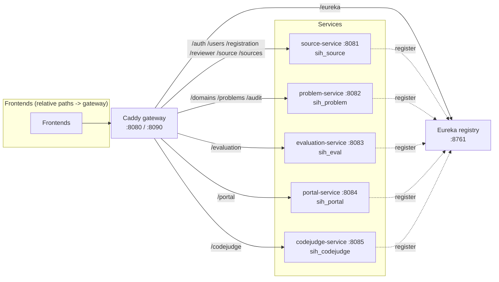
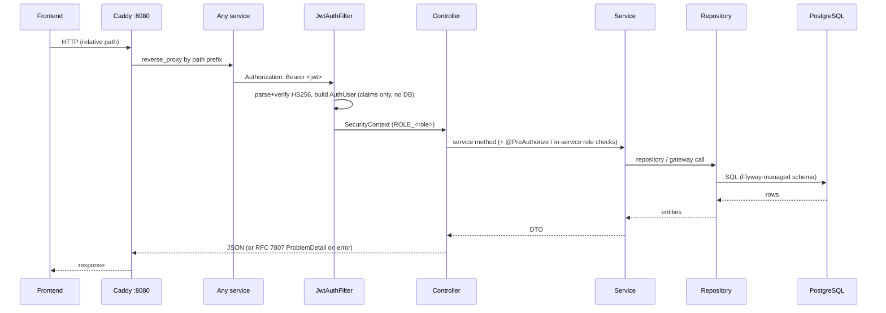

# Backend Overview — SIH26043 National Innovation Lifecycle Platform

> Source-of-truth technical reference for the backend as it exists at audit time.
> This document describes **implemented** behavior only. Anything not verifiable
> in code is labelled `UNKNOWN`/`UNVERIFIED`. See `BACKEND_GAPS_AND_UNKNOWNS.md`
> for discrepancies.

---

## 1. Architecture

A **polyglot microservices mesh** — no application monolith, no shared database.
Five Spring Boot services, each owning a private PostgreSQL database, register with
Netflix Eureka and are fronted by a Caddy reverse-proxy gateway.

Service-to-service calls are **not** routed through the gateway — they go direct
on the internal ports via the `/internal/**` surface (Eureka-resolved by service
id). See §6.

### Module boundaries

| Module | Port | DB | Responsibility |
|:---|:---:|:---|:---|
| `source-service` | 8081 | `sih_source` | Identity, phone-OTP auth, RBAC, source registration + verification + source accounts |
| `problem-service` | 8082 | `sih_problem` | Problem ingestion, SHA-256 evidence vault, domain taxonomy, access rules, problem-scoped audit |
| `evaluation-service` | 8083 | `sih_eval` | Evaluation cycles, AI/heuristic analysis, least-loaded routing, weighted rubric scoring, project reviews |
| `portal-service` | 8084 | `sih_portal` | Published-problem catalog, participant onboarding, submission dossiers, files, resubmission lifecycle |
| `codejudge-service` | 8085 | `sih_codejudge` | Static repository analysis + agentic-legibility scoring (git clone + Python analyzer) |
| `eureka-server` | 8761 | in-memory | Service discovery |
| `gateway` (Caddy) | 8080/8090 | n/a | Reverse proxy, path routing, `/internal/**` shielding |

---

## 2. Technologies & Dependencies

From `backend/pom.xml` and per-service poms:

| Technology | Version / note |
|:---|:---|
| Java | 21 LTS |
| Spring Boot (parent) | **4.1.1** |
| Spring Cloud | 2025.1.3 (Boot-4 Eureka line) |
| Build | Maven (multi-module reactor, `./mvnw`) |
| Lombok | 1.18.46 (annotation processing) |
| Persistence | Spring Data JPA / Hibernate (`ddl-auto: validate`) |
| Migrations | Flyway (`classpath:db/migration`) |
| Database | PostgreSQL 16 + PostGIS (`postgis/postgis:16-3.4`) |
| JWT | Nimbus `spring-security-oauth2-jose` (HS256, `SignedJWT`) |
| JSON | Jackson 3 (`tools.jackson`) in problem/evaluation/codejudge; standard Jackson elsewhere |
| Service discovery | Spring Cloud Netflix Eureka client + `LoadBalancerClient` |
| HTTP clients | Spring `RestClient` + `HttpServiceProxyFactory` (`@HttpExchange`) |
| Gateway | Caddy 2 (static `Caddyfile`) |
| LLM | OpenAI-compatible interface (`DeepSeek-V4`/`agentrouter` routing), advisory + deterministic fallback |
| CodeJudge analyzer | `git` + `python3` (custom `Dockerfile.codejudge`) |

Modules in the Maven reactor: `edith-common`, `edith-security`, `eureka-server`,
`source-service`, `problem-service`, `evaluation-service`, `portal-service`,
`codejudge-service`.

- `edith-common` — shared enums (`UserRole`, `SourceBucket`, etc.), `ApiException`,
  and internal DTOs (`SourceAccountResponse`, `SourceAccountDetail`,
  `ProblemContextResponse`).
- `edith-security` — `JwtService`, `JwtAuthFilter`, `AuthUser` (claim-derived principal).

---

## 3. Application Entry Points & Configuration

Each service has a `@SpringBootApplication` main class (e.g. `SourceServiceApp`,
`ProblemServiceApp`, `EvaluationServiceApp`, `PortalServiceApp`,
`CodeJudgeServiceApp`, `EurekaServerApp`).

All services share the same configuration shape (`application.yaml`), parameterized
by env vars (see `backend/docker-compose.yml` and `backend/.env.example`):

| Env var | Meaning | Default |
|:---|:---|:---|
| `SERVER_PORT` | service port | 8081–8085 by service |
| `DB_URL` / `DB_USERNAME` / `DB_PASSWORD` | datasource | `jdbc:postgresql://localhost:5432/sih_<svc>` / `sih` / `sih` |
| `JWT_SECRET` | HMAC-SHA256 signing secret (shared across services) | empty → dev fallback |
| `IDENTITY_PEPPER` (source only) | HMAC pepper for OTP hashes | empty → dev fallback |
| `MOCK_OTP_CODE` (source only) | fixed OTP code when non-prod | empty → random |
| `EVIDENCE_STORAGE_DIR` (problem) | evidence file dir | `./data/evidence` |
| `PORTAL_FILE_STORAGE_DIR` (portal) | submission file dir | `./data/portal-files` |
| `CODEJUDGE_*` (codejudge) | analyzer/workspace dirs, queue knobs, sandbox flag | see §7 |
| `OPENAI_API_KEY` / `OPENAI_BASE_URL` / `OPENAI_MODEL` | LLM | empty / `http://localhost:20128/v1` / `agentrouter/deepseek-v4-flash` |
| `EVALUATION_AUTO_ENABLED` (evaluation) | AI scoring kill switch | `true` |
| `SOURCE_SERVICE_URL` / `EVALUATION_SERVICE_URL` / `CODEJUDGE_SERVICE_URL` / `PROBLEM_SERVICE_URL` | peer base URLs (Eureka service ids) | `http://<service>` |
| `EUREKA_SERVER_URL` | registry URL | `http://localhost:8761/eureka/` |

`spring.jpa.hibernate.ddl-auto: validate` in every service — Flyway owns schema
creation; Hibernate only validates. `open-in-view: false`; Hikari pool size 10;
`hibernate.jdbc.time_zone: UTC`.

---

## 4. Request Execution Flow

- **Validation**: `jakarta.validation` on request DTOs → `MethodArgumentNotValidException`
  → 400 `"Validation failed"` + `fieldErrors` map (RFC 7807 `ProblemDetail`,
  `type=about:blank`).
- **Errors**: every service has an identical `GlobalExceptionHandler` mapping
  `ApiException` → its status, `AccessDeniedException` → 403, catch-all → 500.
- **Transactions**: `@Transactional` on service methods; `@Version` optimistic
  locking on mutable aggregates (`Problem`, `Submission`, `SourceAccount`,
  `SourceRegistration`, `EvaluationCycle`, `EvaluationAssignment`,
  `ScoreAggregation`, `ProjectReview`, `Evaluation`, `EvaluationJob`, `Participant`,
  `PublishedProblem`, `EvaluatorProfile`, `EvaluatorPoolMode`).

---

## 5. Authentication Architecture

Passwordless phone-OTP + stateless JWT. All details in `BUSINESS_LOGIC.md` §2.

- **OTP**: `POST /auth/register` (creates SUBMITTER) or `POST /auth/login`
  (existing user) issues a 6-digit OTP. Only the **HMAC-SHA256 (peppered) hash**
  is stored (`otp_challenge.otp_code_hash`). 5-min TTL, max 3 verify attempts,
  5 requests/phone/hour. Non-prod returns the code in `devOtp` (and supports a
  fixed `MOCK_OTP_CODE`); prod sends a random code (SMS dispatch is a placeholder).
- **Token pair**: `POST /auth/verify-otp` → HS256 access JWT (15-min TTL, claims
  `sub`, `iss=sih26043`, `iat`, `exp`, `phone`, `role`, `kyc`) + server-side UUID
  refresh token (7-day TTL).
- **Rotation/revocation**: `POST /auth/refresh` rotates (revokes old, mints new).
  `POST /auth/logout` revokes the refresh token. Access token remains valid until
  TTL (no server-side revocation list).
- **Authorization**: `JwtAuthFilter` derives `AuthUser` (userId, phone, role, kyc)
  **entirely from claims — no DB lookup**, enabling role checks in services that
  do not own the `users` table. Authority = `ROLE_<role>`.
- **Roles**: `SUBMITTER`, `REVIEWER`, `ADMIN`, `EVALUATOR` (see `UserRole`).
- **Public vs protected**: each service's `SecurityConfig` permits `OPTIONS /**`,
  Swagger/`/v3/api-docs`, `/error`, and `/internal/**`; source-service additionally
  permits `/auth/**`, `POST /registration`, `GET /registration/source-types`,
  `GET /registration/{id}/status`, `GET /domains`. Everything else `authenticated()`.
  Role-gating via `@PreAuthorize` (source, problem, evaluation, codejudge) and
  in-service role checks (portal).

---

## 6. External Integrations & Service-to-Service Calls

| Caller | Target | Path | Purpose | Failure behavior |
|:---|:---|:---|:---|:---|
| problem-service | source-service | `GET /internal/source-accounts/{id}` | authorize problem submission | 404/502/503 mapped, throws |
| evaluation-service | problem-service | `GET /internal/problems/{id}` | intake status + analysis context | throws (blocks start/analyze) |
| evaluation-service | portal-service | `POST /internal/published-problems` | auto-publish at `EVALUATION_COMPLETED` | best-effort (swallowed) |
| evaluation-service | portal-service | `POST /internal/submissions/{id}/review-result` | land ACCEPT/RETURNED on submission | best-effort (swallowed) |
| portal-service | source-service | `GET /internal/users/{userId}/source-accounts` | classify caller as UNIVERSITY | 404 → empty list; 502/503 → throws |
| portal-service | evaluation-service | `POST /internal/project-reviews` | open same-evaluator review on submit | **blocking** — failure rolls back submit |
| portal-service | codejudge-service | `POST /internal/codejudge/evaluations` | queue automated repo evaluation | best-effort (never fails submit) |
| codejudge-service | problem-service | `GET /internal/problems/{id}` | problem-statement snapshot at intake | tolerant (null-safe) |

Peer resolution: `LoadBalancerClient.choose(serviceId)` (Eureka), via a custom
`DiscoveryResolvingInterceptor` (deliberately not `@LoadBalanced RestClient.Builder`
to avoid a discovery cycle). Timeouts: connect 2s; read 5s (problem→source,
codejudge→problem), 10s (portal→evaluation, portal→codejudge).

LLM integrations (advisory with deterministic fallback):
- **problem-service**: `OpenAiCompatibleDomainResolutionClient` resolves a problem's
  domains for `AUTO_SELECTED_UNIVERSITIES`. Empty API key → feature fails closed
  (400), never widens audience.
- **evaluation-service**: `OpenAiCompatibleAnalysisClient` (problem analysis) and
  `OpenAiCompatibleCriterionScoringClient` (AUTO pool scoring), both with
  `HeuristicAnalysisFallback` / human degradation.
- **codejudge-service**: `AiAdvisor` (advisory narrative only — deterministic
  engine owns the score). Empty key → `UNAVAILABLE`, run completes.

---

## 7. Database Overview

Five isolated PostgreSQL databases (`sih_source`, `sih_problem`, `sih_eval`,
`sih_portal`, `sih_codejudge`), created by `backend/db/init/01-create-service-dbs.sql`
on fresh volumes. Full schema/enums/relationships in `DATA_MODEL.md`.

Cross-service references are **plain UUID columns with no FK** (services are
decoupled): e.g. `problem.submitted_by_user_id`, `evaluation_cycle.problem_id`,
`submission.reviewer_user_id`. Intra-service FKs are declared in Flyway DDL
(e.g. `evidence.problem_id → problem ON DELETE CASCADE`).

Postgres **native enums** are used for domain enums (`CREATE TYPE … AS ENUM`),
mapped via `@JdbcTypeCode(SqlTypes.NAMED_ENUM)` + `columnDefinition`. JSONB for
`Map`/`List` fields (`@JdbcTypeCode(SqlTypes.JSON)`).

### Migrations baseline

| Service | Migrations |
|:---|:---|
| source-service | `V1__source_schema.sql`, `V2__seed_dev_users.sql` |
| problem-service | `V1__problem_schema.sql`, `V2__domain_seed.sql`, `V3__problem_access_rule.sql`, `V4__auto_selected_universities_rule.sql`, `V5__university_catalog.sql` |
| evaluation-service | `V1__evaluation_schema.sql`, `V2__evaluation_seed_data.sql`, `V3__project_review.sql`, `V4__auto_evaluation.sql`, `V5__seed_demo_evaluator_profile.sql` |
| portal-service | `V1__portal_schema.sql`, `V2__access_rule_auto_selected.sql`, `V3__submission_commit_ref.sql` |
| codejudge-service | `V1__codejudge_schema.sql`, `V2__codejudge_seed.sql`, `V3__problem_snapshot.sql` |

---

## 8. Key Configuration Requirements

- **JWT_SECRET** must be shared across all five services (same signing key). In
  production it must be ≥32 chars (HS256). `JwtService` throws at startup on prod
  if empty/short.
- **IDENTITY_PEPPER** (source-service) must be ≥16 chars in production (`HmacHasher`).
- **OPENAI_API_KEY** is optional but load-bearing for:
  - problem-service `AUTO_SELECTED_UNIVERSITIES` (fails closed with 400 if empty);
  - evaluation-service AUTO pool AI scoring (degrades to human if empty);
  - codejudge AI advisory (records `UNAVAILABLE` if empty).
- **File storage volumes**: `evidence` (problem), `portal-files` (portal),
  `codejudge-workspaces` (codejudge) must be writable.
- **codejudge-service** needs `git` + `python3` on the container (custom
  `Dockerfile.codejudge`); `CODEJUDGE_SANDBOX_ENABLED=false` means no student code
  is executed (BUILDING/RUNNING/TESTING stages are never entered).
- **Eureka self-preservation** is disabled so stopped instances disappear fast.
