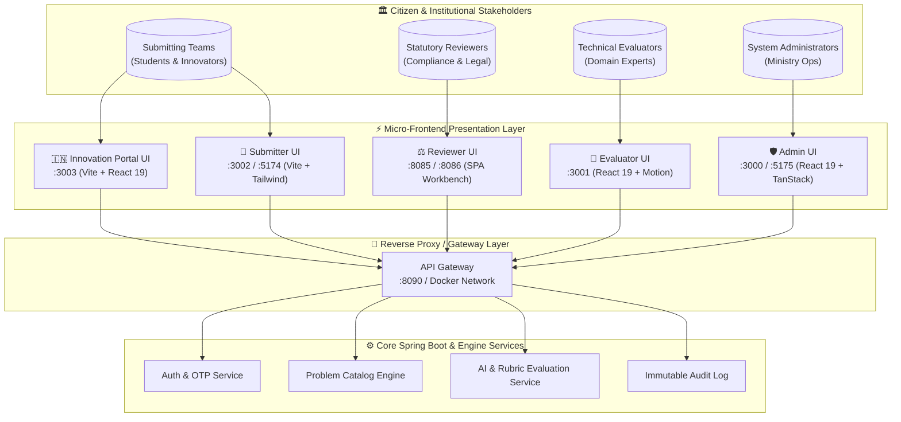

<div align="center">

# 🇮🇳 SIH 2024 · National Innovation & Evaluation Architecture
### **Next-Gen Institutional Problem Repository & Multi-Role Assessment Suite**

[](https://vitejs.dev/)
[](https://react.dev/)
[](https://tailwindcss.com/)
[](https://www.docker.com/)
[](#)

<p align="center">
  A state-of-the-art suite of 5 dedicated frontends tailored for the Ministry of Education & Government of India innovation workflow — featuring role-based workflows, real-time telemetry, automated rubric scoring, and institutional casing.
</p>

---

</div>

## 📑 Table of Contents
- [🏛️ Ecosystem Overview](#-ecosystem-overview)
- [🌐 Applications & Ports Matrix](#-applications--ports-matrix)
- [⚡ Quick Start with Docker](#-quick-start-with-docker)
- [🛠️ Local Development (Hot Reload)](#️-local-development-hot-reload)
- [🧩 Frontend Suite Breakdown](#-frontend-suite-breakdown)
  - [1. 🇮🇳 Innovation Portal UI (`innovation-portal-ui`)](#1--innovation-portal-ui-innovation-portal-ui)
  - [2. ⚖️ Reviewer Case Management UI (`reviewer-ui`)](#2-️-reviewer-case-management-ui-reviewer-ui)
  - [3. 🛡️ Administrative Portal (`admin-ui`)](#3-️-administrative-portal-admin-ui)
  - [4. 🎯 Evaluator Interface (`evaluator-ui`)](#4--evaluator-interface-evaluator-ui)
  - [5. 📝 Submitter Interface (`submitter-ui`)](#5--submitter-interface-submitter-ui)
- [🏗️ Container Architecture](#️-container-architecture)
- [🔄 Zero-Downtime Hot Reload & Rebuild Protocol](#-zero-downtime-hot-reload--rebuild-protocol)
- [🔌 API Gateway & Proxies](#-api-gateway--proxies)

---

## 🏛️ Ecosystem Overview



---

## 🌐 Applications & Ports Matrix

| App Icon | Application | Local Dev Port | Docker Port | Technology Stack | Primary Persona & Responsibility |
|:---:|:---|:---:|:---:|:---|:---|
| 🇮🇳 | **[`innovation-portal-ui`](./innovation-portal-ui)** | `3003` | `3003` | React 19, Tailwind CSS v4, Framer Motion, Confetti | **Flagship Portal**: National Challenge Repository, OTP Auth, Problem Catalog & Submissions Dossier |
| ⚖️ | **[`reviewer-ui`](./reviewer-ui)** | `8085` / `8086` | — | Vanilla Modern JS, Glassmorphism, Material Symbols | **Reviewer Workbench**: Statutory verification, conflict check, and problem clearance |
| 🛡️ | **[`admin-ui`](./admin-ui)** | `5175` | `3000` | React 19, TypeScript, TanStack Query, Tailwind | **Operations HQ**: User orchestration, domain mapping, audit trails, and nodal institute controls |
| 🎯 | **[`evaluator-ui`](./evaluator-ui)** | `3001` | `3001` | React 19, Tailwind CSS v4, Motion, Lucide | **Evaluation Engine**: Double-blind rubric scoring, consensus analysis & score aggregation |
| 📝 | **[`submitter-ui`](./submitter-ui)** | `5174` | `3002` | Vite, Modern Semantic HTML5, Tailwind CSS | **Submission Hub**: Problem source submission, challenge drafting & proposal tracking |

---

## ⚡ Quick Start with Docker

Launch the containerized frontend network with a single command from the project root:

```bash
# Clone and navigate to project root
cd bana-to-lete-hai-pehle

# Build and start all frontend containers concurrently
docker compose up -d --build
```

### Verification & Monitoring
```bash
# View real-time container health and status
docker compose ps

# Stream unified logs across all running frontends
docker compose logs -f
```

### URLs when running in Docker:
- 🇮🇳 **Innovation Portal UI**: [http://localhost:3003](http://localhost:3003)
- 🎯 **Evaluator UI**: [http://localhost:3001](http://localhost:3001)
- 📝 **Submitter UI**: [http://localhost:3002](http://localhost:3002)
- 🛡️ **Admin UI**: [http://localhost:3000](http://localhost:3000)

---

## 🛠️ Local Development (Hot Reload)

For active feature development and instant HMR, run the applications independently:

### 1. Innovation Portal UI (Flagship)
```bash
cd frontend/innovation-portal-ui
npm install
npm run dev
# ➜ Served on http://localhost:3003
```

### 2. Reviewer Case Management Portal
```bash
cd frontend/reviewer-ui
# Run with python HTTP server directly or execute run.bat
python -m http.server 8085
# ➜ Served on http://localhost:8085/#/login
```

### 3. Admin UI
```bash
cd frontend/admin-ui
npm install
npm run dev -- --port 5175
# ➜ Served on http://localhost:5175
```

### 4. Evaluator UI
```bash
cd frontend/evaluator-ui
npm install
npm run dev
# ➜ Served on http://localhost:3001
```

### 5. Submitter UI
```bash
cd frontend/submitter-ui
npm install
npm run dev
# ➜ Served on http://localhost:5174
```

---

## 🧩 Frontend Suite Breakdown

### 1. 🇮🇳 Innovation Portal UI (`innovation-portal-ui`)
> **Flagship Public & Authenticated Experience for SIH Grand Finale.**
- **Aesthetic**: Premium Indian tricolor accents, subtle ambient sweeps, clean typography (`IBM Plex Sans` + `Inter` + `JetBrains Mono`).
- **Core Features**:
  - Split-screen landing experience with narrative hero, stats ticker, and seamless OTP challenge.
  - Interactive **Problem Catalog** with real-time fuzzy search, urgency filters, and domain tagging.
  - **Submissions Dossier**: Multi-document viewer, SHA-256 integrity verification, and instant download.
  - Interactive confetti animations for successful milestone resubmissions.

### 2. ⚖️ Reviewer Case Management UI (`reviewer-ui`)
> **Institutional Case Verification & Legal Compliance Workbench.**
- **Aesthetic**: High-density glassmorphism with high-contrast audit readability.
- **Core Features**:
  - Review queue with status filtering (Pending, In-Review, Flagged, Approved).
  - Split-pane review: side-by-side problem statement, source authenticity, and statutory checklists.
  - Built-in `run.bat` launcher for instant zero-dependency deployment.

### 3. 🛡️ Administrative Portal (`admin-ui`)
> **Centralized Command Center for Ministry Administrators.**
- **Aesthetic**: Modern enterprise control deck.
- **Core Features**:
  - Global user directory, role assignments (Admin, Evaluator, Reviewer, Submitter).
  - Domain categorization engine and university assignment matrix.
  - Immutable audit logs capturing all administrative and scoring events.

### 4. 🎯 Evaluator Interface (`evaluator-ui`)
> **Double-Blind Evaluation & Automated Scoring Engine.**
- **Aesthetic**: Focused dark/light ergonomic workspace powered by Tailwind v4 and Motion.
- **Core Features**:
  - Multi-criterion scoring rubrics (Innovation, Feasibility, Impact, Methodology).
  - Real-time consensus indicators and AI-assisted evaluation consistency flags.
  - Secure proposal evaluation sandbox with attachment preview.

### 5. 📝 Submitter Interface (`submitter-ui`)
> **Intuitive Self-Service Submission Portal for Problem Statements.**
- **Aesthetic**: Accessible, modern Government-standard design.
- **Core Features**:
  - Multi-step guided problem declaration wizard.
  - Ministry / PSU / Academic classification selector.
  - Draft autosave and submission revision tracking.

---

## 🏗️ Container Architecture

Each frontend application is containerized using optimized **multi-stage Docker builds**:

```
┌────────────────────────────────────────────────────────┐
│  Stage 1: Build Phase (node:20-alpine)                 │
│  - Copies package specifications & resolves lockfile   │
│  - Compiles TypeScript & bundles tree-shaken assets   │
│  - Outputs optimized static bundle into /dist         │
└──────────────────────────┬─────────────────────────────┘
                           │ Static artifacts transfer
┌──────────────────────────▼─────────────────────────────┐
│  Stage 2: Production Serving (nginx:alpine)            │
│  - Lightweight, hardened alpine base (<25MB image)     │
│  - Custom nginx.conf with SPA fallback routing         │
│  - Reverse proxies /api and backend endpoints cleanly  │
└────────────────────────────────────────────────────────┘
```

---

## 🔄 Zero-Downtime Hot Reload & Rebuild Protocol

> [!IMPORTANT]
> Because production Docker images bundle pre-compiled static assets into Nginx, running `docker restart <container>` will **not** reflect live source code modifications.

When making updates to source code, rebuild the specific image targeting that service:

```bash
# Rebuild Evaluator UI only
docker compose up -d --build evaluator-ui

# Rebuild Innovation Portal UI only
docker compose up -d --build innovation-portal-ui

# Rebuild Admin UI only
docker compose up -d --build admin-ui

# Rebuild Submitter UI only
docker compose up -d --build submitter-ui
```

---

## 🔌 API Gateway & Proxies

All frontends are pre-configured to communicate seamlessly with the backend microservices via the gateway:

| Route Prefix | Target Service | Purpose |
|:---|:---|:---|
| `/auth/*` | Auth Gateway (`:8090`) | OTP generation, token verification, session lifecycle |
| `/problems/*` | Problem Service (`:8090`) | Problem ingestion, catalog querying, metadata |
| `/evaluation/*` | Evaluation Service (`:8090`) | Scoring submission, consensus routing, rubrics |
| `/reviewer/*` | Reviewer Service (`:8090`) | Case allocations, compliance validations |
| `/users/*` | User Service (`:8090`) | Identity profiles and credential management |

---

<div align="center">

Made with ❤️ for **Smart India Hackathon 2024** · SIH26043

</div>